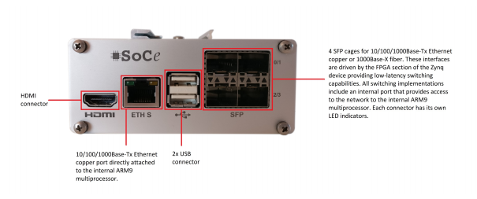
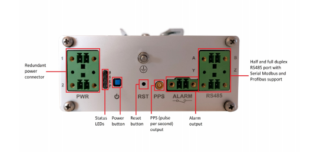
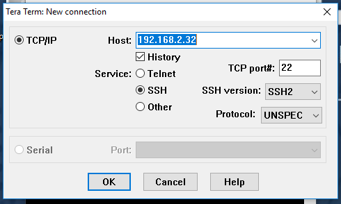

Run a simple PYTHON sample on RELY-CPPS device running Debian Linux
===
---

# Table of Contents

-   [Introduction](#Introduction)
-   [Step 1: Prerequisites](#Prerequisites)
-   [Step 2: Prepare your Device](#PrepareDevice)
-   [Step 3: Build and Run the Sample](#Build)
-   [Next Steps](#NextSteps)

# Introduction

**About this document**

This document describes how to connect {enter your device name here} device running {enter the OS name running on device} with Azure IoT SDK. This multi-step process includes:
-   Configuring Azure IoT Hub
-   Registering your IoT device
-   Build and deploy Azure IoT SDK on device

# Step 1: Prerequisites

You should have the following items ready before beginning the process:

-   [Prepare your development environment][setup-devbox-python]
-   [Setup your IoT hub][lnk-setup-iot-hub]
-   [Provision your device and get its credentials][lnk-manage-iot-hub]
-   RELY-CPPS device.

# Step 2: Prepare your Device

    

    

-   RELY- CPPS can receive power from a 6V DC to 30V DC power source. Input power is applied to the positive (V+) and negative (V-) terminals on the connector. 

-   Use the power adaptor supplied with the equipment to connect the device to a power supply. It will take approximately 30 seconds until the operating system is booted and RELY- CPPS is ready for use. 

-   Connections to the console of RELY-CPPS can be made through one of the Ethernet ports available on the device. To do so, a terminal emulation program like HyperTerminal or Tera Term is required. 

# Step 3: Build and Run the sample

## 3.1 Build SDK and sample

-   Open a TeraTerm session or use an alternative terminal application, and connect to the device, using a SSH connection. 

-   In the example above, the factory IP address has been used.

    

    Introduce the correct user and password to proceed and to access the command line:

    **User:** linaro

    **Password:** linaro

-   Install the prerequisite packages for the Microsoft Azure IoT Device SDK for Python by issuing the following commands from the command line on your board:

        sudo apt-get update

        sudo apt-get install -y curl libcurl4-openssl-dev build-essential cmake git python2.7-dev libboost-python-dev

-   Download the Microsoft Azure IoT Device SDK to the board by issuing the following command on the board::

        git clone --recursive https://github.com/Azure/azure-iot-sdk-python.git

-   Run following commands to build the SDK:

        cd python/build_all/linux
	    sudo ./build.sh    

-   After a successful build, the `iothub_client.so` Python extension module is copied to the **python/device/samples** folder.

- Navigate to samples folder by executing following command:

        cd azure-iot-sdk-python/device/samples/

-   Edit the following file using any text editor of your choice:
    **For MQTT protocol:**

        nano iothub_client_sample_mqtt.py

-   Find the following place holder for device connection string:

        connectionString = "[device connection string]"

-   Replace the above placeholder with device connection string you obtained in [Step 1](#Prerequisites) and save the changes.

## 3.2 Send Device Events to IoT Hub:

-   Run the sample application using the following command:
    **For MQTT protocol:**

        python iothub_client_sample_mqtt.py

-   See [Manage IoT Hub][lnk-manage-iot-hub] to learn how to observe the messages IoT Hub receives from the application.

## 3.3 Receive messages from IoT Hub

-   See [Manage IoT Hub][lnk-manage-iot-hub] to learn how to send cloud-to-device messages to the application.

-   As an example, go to the “Message to device” tab in the Device Explorer Twin, and fill in the fields:

    -   IoT Hub
    -   Device ID (as defined in the IoT Hub)
    -   Message: free text to do the testing. In the example above, the text “test_msg” has been used.

-   Press “Send” button.

# Next Steps

You have now learned how to run a sample application that collects sensor data and sends it to your IoT hub. To explore how to store, analyze and visualize the data from this application in Azure using a variety of different services, please click on the following lessons:

-   [Manage cloud device messaging with iothub-explorer]
-   [Save IoT Hub messages to Azure data storage]
-   [Use Power BI to visualize real-time sensor data from Azure IoT Hub]
-   [Use Azure Web Apps to visualize real-time sensor data from Azure IoT Hub]
-   [Weather forecast using the sensor data from your IoT hub in Azure Machine Learning]
-   [Remote monitoring and notifications with Logic Apps]   

[Manage cloud device messaging with iothub-explorer]: https://docs.microsoft.com/en-us/azure/iot-hub/iot-hub-explorer-cloud-device-messaging
[Save IoT Hub messages to Azure data storage]: https://docs.microsoft.com/en-us/azure/iot-hub/iot-hub-store-data-in-azure-table-storage
[Use Power BI to visualize real-time sensor data from Azure IoT Hub]: https://docs.microsoft.com/en-us/azure/iot-hub/iot-hub-live-data-visualization-in-power-bi
[Use Azure Web Apps to visualize real-time sensor data from Azure IoT Hub]: https://docs.microsoft.com/en-us/azure/iot-hub/iot-hub-live-data-visualization-in-web-apps
[Weather forecast using the sensor data from your IoT hub in Azure Machine Learning]: https://docs.microsoft.com/en-us/azure/iot-hub/iot-hub-weather-forecast-machine-learning
[Remote monitoring and notifications with Logic Apps]: https://docs.microsoft.com/en-us/azure/iot-hub/iot-hub-monitoring-notifications-with-azure-logic-apps
[setup-devbox-python]: https://github.com/Azure/azure-iot-device-ecosystem/blob/master/get_started/python-devbox-setup.md
[lnk-setup-iot-hub]: ../setup_iothub.md
[lnk-manage-iot-hub]: ../manage_iot_hub.md
