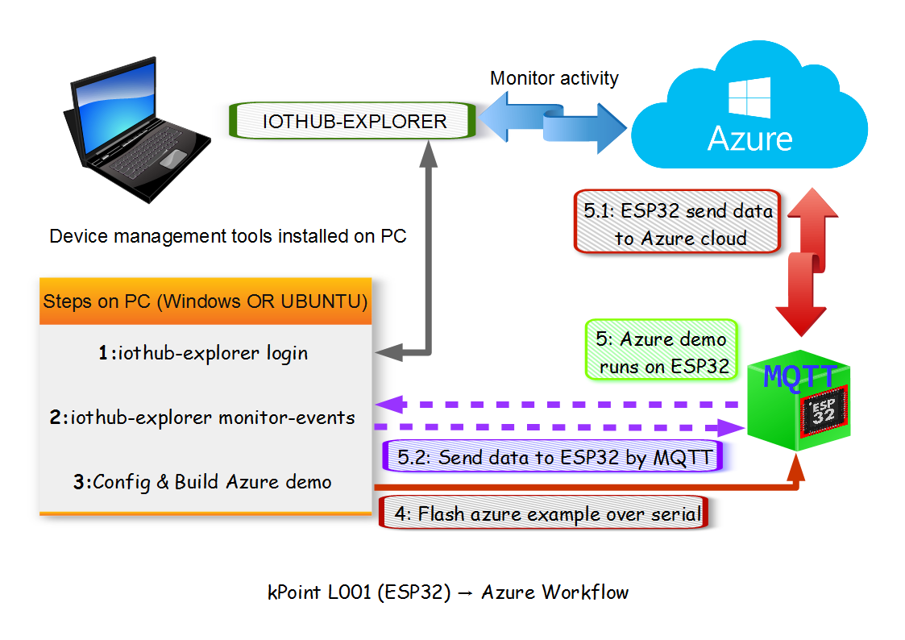

Run a simple C sample on kPoint L001 device running No-OS firmware
===
---

# Table of Contents
-   [Introduction](#Introduction)
-   [Step 1: Prerequisites](#Prerequisites)
-   [Step 2: SDK and Tools Preparation](#tools-prepare)
-   [Part 3: Configuring and building](#config-build)
-   [Part 4: Result shows](#results)
-   [TroubleShoot](#troubleshoot)
-   [Next Steps](#NextSteps)

# Introduction

ESP32 is one of gorgeous ioT device that can interface with other systems to provide Wi-Fi and Bluetooth functionality through the SPI / SDIO or I2C / UART interfaces.for more details, click <https://espressif.com/en/products/hardware/esp32/overview>

Azure cloud is one of wonderful cloud that could collect data from lot device or push data to lot device,for more details, click <https://www.azure.cn/home/features/iot-hub/>

kPoint L001 Based on ESP32 processor is ready-to-use customized product in DIN rail mountable case with integrated sensors inside: acceleration sensor, light sensor, air temperature sensor.

**Aim:**

This page would guide you connecting your device(ESP32 or lot device with ESP32) to Azure by MQTT protocol, and then send data to Azure,receive message from Azure.Main workflow:
 
 

# Step 1: Prerequisites

You should have the following items ready before beginning the process:

-   Ubuntu environment
-   [Setup your IoT hub][lnk-setup-iot-hub]
-   [Provision your device and get its credentials][lnk-manage-iot-hub]
-   ESP32 device for running the demo.  
    

# Step 2: SDK and Tools Preparation

### iothub-explorer install

-   The iothub-explorer tool enables you to provision, monitor, and delete devices in your IoT hub. It runs on any operating system where Node.js is available.
-   Download and install Node.js from [here](https://nodejs.org/en/).
-   From a command line (Command Prompt on Windows, or Terminal on Mac OS X), execute the following:

        npm install -g iothub-explorer

-   If success, you can get version information like:

        $ node -v
        v6.9.5
        $ iothub-explorer -V
        1.1.6

-   If failed,please click <http://thinglabs.io/workshop/esp8266/setup-azure-iot-hub/>
  
### SDK get

-   You can get AZURE-SDK from <https://github.com/ustccw/AzureESP32> to connect ESP32 to Azure by MQTT protocol.  
-   You can get IDF-SDK from <https://github.com/espressif/esp-idf>. This SDK can make ESP32 work well.

### Compiler get

-   Follow the guide: <http://esp-idf.readthedocs.io/en/latest/linux-setup.html>.

# Step 3: Configuring and building

### Update Variables

**/examples/project\_template/user/iothub\_client\_sample\_mqtt.c**

-   Update the connectionString variable to the device-specific connection string you got earlier from the Setup Azure IoT step:

        static const char* connectionString = '[azure connection string]'

-   The azure connection string contains Hostname, DeviceId, and SharedAccessKey in the format:

        "HostName=<host_name>;DeviceId=<device_id>;SharedAccessKey=<device_key>"

### Config your Wifi

    make menuconfig

-   Choose example configuration to **set Wifi SSID and Password!**
 
### Build your demo and flash to ESP32
 
    $make flash

-   If failed,try:
    -   make sure that ESP32 had connect to PC by serial port 
    -   make sure you flash to correct serial port
    -   try type command:
        > sudo usermod -a -G dialout $USER
 

# Step 4: Result shows

-   Login iothub-explorer,and monitor events:

        iothub-explorer monitor-events AirConditionDevice_001 --login '<connection-string>'

-   Restart ESP32 device after bin had flashed. You would see the ESP32 device send data to lothub-explorer by minicom and iothub-explorer would receive data.

- At the same time,you can send message to ESP32 device by iothub-explorer until you send a quit message

#TroubleShoot

-   Close some firewall settings
-   Build failed, try:
    -   git submodule init
    -   git submodule update
    -   export your compiler path 
    -   export your SDK path
    -   get start with <http://espressif.com/en/support/download/documents?keys=&field_type_tid%5B%5D=13>
    -   make sure you had input correct device connection string

# Next Steps

You have now learned how to run a sample application that collects sensor data and sends it to your IoT hub. To explore how to store, analyze and visualize the data from this application in Azure using a variety of different services, please click on the following lessons:

-   [Manage cloud device messaging with iothub-explorer]
-   [Save IoT Hub messages to Azure data storage]
-   [Use Power BI to visualize real-time sensor data from Azure IoT Hub]
-   [Use Azure Web Apps to visualize real-time sensor data from Azure IoT Hub]
-   [Weather forecast using the sensor data from your IoT hub in Azure Machine Learning]
-   [Remote monitoring and notifications with Logic Apps]   

[Manage cloud device messaging with iothub-explorer]: https://docs.microsoft.com/en-us/azure/iot-hub/iot-hub-explorer-cloud-device-messaging
[Save IoT Hub messages to Azure data storage]: https://docs.microsoft.com/en-us/azure/iot-hub/iot-hub-store-data-in-azure-table-storage
[Use Power BI to visualize real-time sensor data from Azure IoT Hub]: https://docs.microsoft.com/en-us/azure/iot-hub/iot-hub-live-data-visualization-in-power-bi
[Use Azure Web Apps to visualize real-time sensor data from Azure IoT Hub]: https://docs.microsoft.com/en-us/azure/iot-hub/iot-hub-live-data-visualization-in-web-apps
[Weather forecast using the sensor data from your IoT hub in Azure Machine Learning]: https://docs.microsoft.com/en-us/azure/iot-hub/iot-hub-weather-forecast-machine-learning
[Remote monitoring and notifications with Logic Apps]: https://docs.microsoft.com/en-us/azure/iot-hub/iot-hub-monitoring-notifications-with-azure-logic-apps
[lnk-setup-iot-hub]: ../setup_iothub.md
[lnk-manage-iot-hub]: ../manage_iot_hub.md
