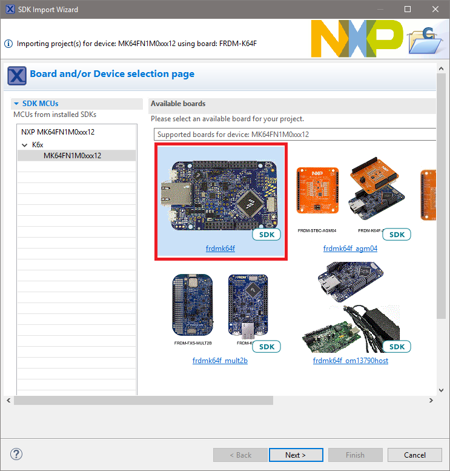
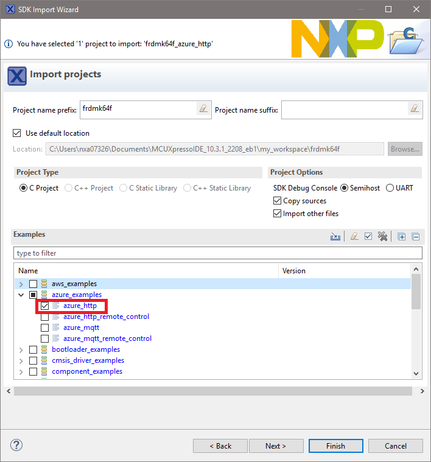
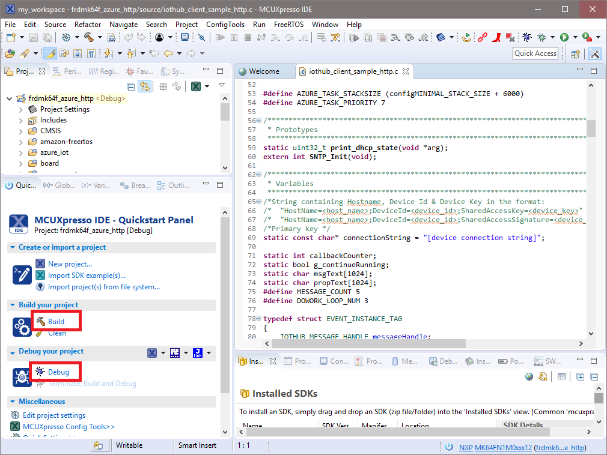

Run a simple C sample on FRDM-K64F device running FreeRTOS
===
---

# Table of Contents

-   [Introduction](#Introduction)
-   [Step 1: Prerequisites](#Prerequisites)
-   [Step 2: Prepare your Device](#PrepareDevice)
-   [Step 3: Build and Run the Sample](#Build)
-   [Next Steps](#NextSteps)

# Introduction

**About this document**

This document describes how to connect [NXP FRDM-K64F](https://www.nxp.com/support/developer-resources/evaluation-and-development-boards/freedom-development-boards/mcu-boards/freedom-development-platform-for-kinetis-k64-k63-and-k24-mcus:FRDM-K64F) with Azure IoT SDK. This multi-step process includes:
-   Configuring Azure IoT Hub
-   Registering your IoT device
-   Build and deploy Azure IoT SDK on device

# Step 1: Prerequisites

You should have the following items ready before beginning the process:

-   [Install MCUXpresso IDE][https://www.nxp.com/support/developer-resources/software-development-tools/mcuxpresso-software-and-tools/mcuxpresso-integrated-development-environment-ide:MCUXpresso-IDE]
-   [Download frdmk64f SDK][https://www.nxp.com/support/developer-resources/software-development-tools/mcuxpresso-software-and-tools/mcuxpresso-software-development-kit-sdk:MCUXpresso-SDK], select all available software components.
-   [Setup your IoT hub][lnk-setup-iot-hub]
-   [Provision your device and get its credentials][lnk-manage-iot-hub]
-   frdmk64f device.

# Step 2: Prepare your Device

-   Connect the board to Computer using a micro USB cable.
-   Connect the board to network using the ethernet cable.

# Step 3: Build SDK and Run the sample

-   Start a new instance of MCUXpresso IDE. Import frdmk64f SDK package.

-   In MCUXpresso IDE open instalation manager and add FRDM-K64F SDK package. Import Azure example, in **Quickstart panel** click **Import SDK example**.

 

-   Select frdmk64f board in import menu.

 

-  Navigate to **azure\_examples** and import the **azure\_http** project.

-   Locate the following code in the file iothub\_client\_sample\_http.c:

        static const char* connectionString = "[device connection string]";

-   Replace the above placeholder with device connection string you obtained in [Step 1](#Prerequisites) and save the changes.
- Build and run the example.

-   See [Manage IoT Hub][lnk-manage-iot-hub] to learn how to observe the messages IoT Hub receives from the application.

-   In **Quickstart panel** click **Debug**, and select appropriate debugger. The console displays messages as the application sends device-to-cloud messages to IoT Hub.

-   See [Manage IoT Hub][lnk-manage-iot-hub] to learn how to send cloud-to-device messages to the application.

# Next Steps

You have now learned how to run a sample application that connects to your IoT hub. To explore how to store, analyze and visualize the data from this application in Azure using a variety of different services, please click on the following lessons:

-   [Manage cloud device messaging with iothub-explorer]
-   [Save IoT Hub messages to Azure data storage]
-   [Use Power BI to visualize real-time sensor data from Azure IoT Hub]
-   [Use Azure Web Apps to visualize real-time sensor data from Azure IoT Hub]
-   [Weather forecast using the sensor data from your IoT hub in Azure Machine Learning]
-   [Remote monitoring and notifications with Logic Apps]

[Manage cloud device messaging with iothub-explorer]: https://docs.microsoft.com/en-us/azure/iot-hub/iot-hub-explorer-cloud-device-messaging
[Save IoT Hub messages to Azure data storage]: https://docs.microsoft.com/en-us/azure/iot-hub/iot-hub-store-data-in-azure-table-storage
[Use Power BI to visualize real-time sensor data from Azure IoT Hub]: https://docs.microsoft.com/en-us/azure/iot-hub/iot-hub-live-data-visualization-in-power-bi
[Use Azure Web Apps to visualize real-time sensor data from Azure IoT Hub]: https://docs.microsoft.com/en-us/azure/iot-hub/iot-hub-live-data-visualization-in-web-apps
[Weather forecast using the sensor data from your IoT hub in Azure Machine Learning]: https://docs.microsoft.com/en-us/azure/iot-hub/iot-hub-weather-forecast-machine-learning
[Remote monitoring and notifications with Logic Apps]: https://docs.microsoft.com/en-us/azure/iot-hub/iot-hub-monitoring-notifications-with-azure-logic-apps
[setup-devbox-windows]: https://github.com/Azure/azure-iot-sdk-c/blob/master/doc/devbox_setup.md
[lnk-setup-iot-hub]: ../setup_iothub.md
[lnk-manage-iot-hub]: ../manage_iot_hub.md
