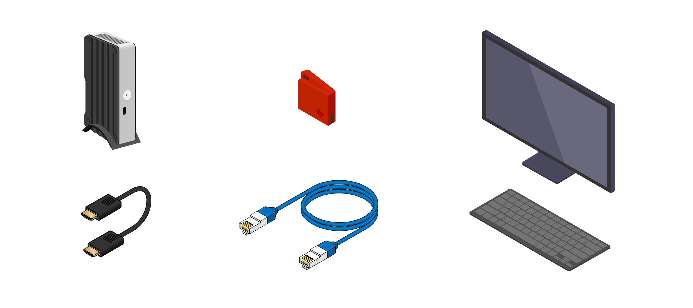
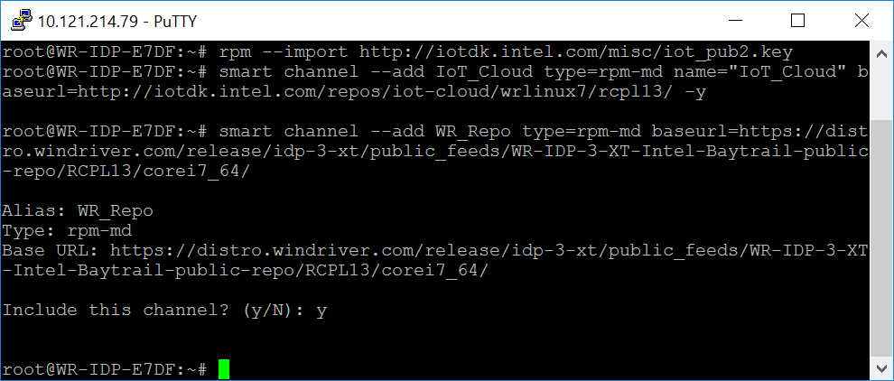

# Set up Intel NUC as an IoT gateway

## What you will do

- Set up Intel NUC as an IoT gateway.
- Install the Azure IoT Edge package on the Intel NUC.
- Run a "hello_world" sample application on the Intel NUC to verify the gateway functionality.

  > If you have any problems, look for solutions on the [troubleshooting page](https://github.com/Microsoft/azure-docs/blob/master/articles/iot-hub/iot-hub-gateway-kit-c-troubleshooting.md).

## What you will learn

In this lesson, you will learn:

- How to connect Intel NUC with peripherals.
- How to install and update the required packages on Intel NUC using the Smart Package Manager.
- How to run the "hello_world" sample application to verify the gateway functionality.

## What you need

- An Intel NUC Kit DE3815TYKE with the Intel IoT Gateway Software Suite (Wind River Linux *7.0.0.13) preinstalled. [Click here to purchase Grove IoT Commercial Gateway Kit](https://www.seeedstudio.com/Grove-IoT-Commercial-Gateway-Kit-p-2724.html).
- An Ethernet cable.
- A keyboard.
- An HDMI or VGA cable.
- A monitor with an HDMI or VGA port.
- Optional: [Texas Instruments Sensor Tag (CC2650STK)](http://www.ti.com/tool/cc2650stk)



## Connect Intel NUC with the peripherals

The image below is an example of Intel NUC that is connected with various peripherals:

1. Connected to a keyboard.
2. Connected to a monitor with a VGA cable or HDMI cable.
3. Connected to a wired network with an Ethernet cable.
4. Connected to a power supply with a power cable.


## Connect to the Intel NUC system from host computer via Secure Shell (SSH)

You will need a keyboard and a monitor to get the IP address of your Intel NUC device. If you already know the IP address, you can skip ahead to step 3 in this section.

1. Turn on the Intel NUC by pressing the power button and then log in.

   The default user name and password are both `root`.

       > Hit the enter key on your keyboard if you see either of the following errors when you boot: 'A TPM error (7) occurred attempting to read a pcr value.' or 'Timeout, No TPM chip found, activating TPM-bypass!'

2. Get the IP address of the Intel NUC by running the `ifconfig` command on the Intel NUC device.

   Here is an example of the command output.

   

   In this example, the value that follows `inet addr:` is the IP address that you need when connect to the Intel NUC from a host computer.

3. Use one of the following SSH clients from your host computer to connect to Intel NUC.

    - [PuTTY](http://www.putty.org/) for Windows.
    - The built-in SSH client on Ubuntu or macOS.

   It is more efficient and productive to operate an Intel NUC from a host computer. You'll need the Intel NUC's IP address, user name and password to connect to it via an SSH client. Here is an example that uses an SSH client on macOS.
   

## Install the Azure IoT Edge package

The Azure IoT Edge package contains the pre-compiled binaries of IoT Edge and its dependencies. These binaries are Azure IoT Edge, the Azure IoT SDK and the corresponding tools. The package also contains a "hello_world" sample application is used to validate the gateway functionality. IoT Edge is the core part of the gateway. 

Follow these steps to install the package.

1. Add the IoT Cloud repository by running the following commands in a terminal window:

   ```bash
   rpm --import https://iotdk.intel.com/misc/iot_pub2.key
   smart channel --add IoT_Cloud type=rpm-md name="IoT_Cloud" baseurl=http://iotdk.intel.com/repos/iot-cloud/wrlinux7/rcpl13/ -y
   smart channel --add WR_Repo type=rpm-md baseurl=https://distro.windriver.com/release/idp-3-xt/public_feeds/WR-IDP-3-XT-Intel-Baytrail-public-repo/RCPL13/corei7_64/
   ```

   > Enter 'y', when it prompts you to 'Include this channel?'

   The `rpm` command imports the rpm key. The `smart channel` command adds the rpm channel to the Smart Package Manager. Before you run the `smart update` command, you will see an output like below.

   

2. Execute the smart update command:

   ```bash
   smart update
   ```

3. Install the Azure IoT Gateway package by running the following command:

   ```bash
   smart install packagegroup-cloud-azure -y
   ```

   `packagegroup-cloud-azure` is the name of the package. The `smart install` command is used to install the package.

    > Run the following command if you see this error: 'public key not available'

    ```bash
    smart config --set rpm-check-signatures=false
    smart install packagegroup-cloud-azure -y
    ```
    > Reboot the Intel NUC if you see this error: 'no package provides util-linux-dev'

   After the package is installed, Intel NUC is ready to function as a gateway.

## Run the Azure IoT Edge "hello_world" sample application

The following sample application creates a gateway from a `hello_world.json` file and uses the fundamental components of Azure IoT Edge architecture to log a hello world message to a file (log.txt) every 5 seconds.

You can run the Hello World sample by executing the following commands:

```bash
cd /usr/share/azureiotgatewaysdk/samples/hello_world/
./hello_world hello_world.json
```

Let the Hello World application run for a few minutes and then hit the Enter key to stop it.


> You can ignore any 'invalid argument handle(NULL)' errors that appear after you hit Enter.

You can verify that the gateway ran successfully by opening the log.txt file that is now in your hello_world folder


Open log.txt using the following command:

```bash
vim log.txt
```

You will then see the contents of log.txt, which will be a JSON formatted output of the logging messages that were written every 5 seconds by the gateway Hello World module.


If you have any problems, look for solutions on the [troubleshooting page](https://github.com/Microsoft/azure-docs/blob/master/articles/iot-hub/iot-hub-gateway-kit-c-troubleshooting.md).

## Summary

Congratulations! You've finished setting up Intel NUC as a gateway. Now you're ready to move on to the next lesson to set up your host computer, create an Azure IoT Hub and register your Azure IoT Hub logical device.

## Next steps
[Use an IoT gateway to connect a device to Azure IoT Hub](https://github.com/Microsoft/azure-docs/blob/master/articles/iot-hub/iot-hub-gateway-kit-c-iot-gateway-connect-device-to-cloud.md)


