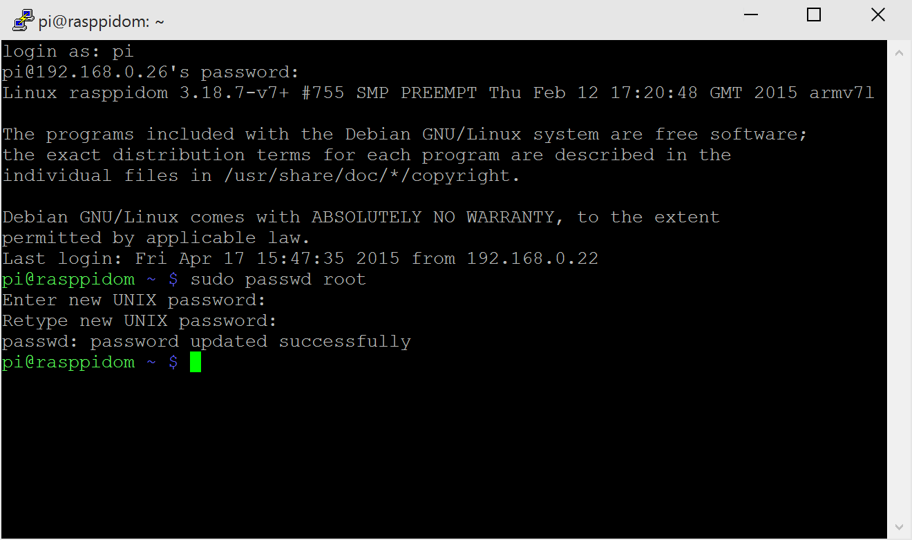

Run a simple C sample on MyPi Industrial IoT Edge Gateway device running Raspbian
===
---

# Table of Contents

-   [Introduction](#Introduction)
-   [Step 1: Prerequisites](#Step-1-Prerequisites)
-   [Step 2: Prepare your Device](#Step-2-PrepareDevice)
-   [Step 3: Build and Run the Sample](#Step-3-Build)
-   [Tips](#tips)
-   [Next Steps](#NextSteps)

# Introduction

**About this document**

This document describes the process of setting up a [MyPi Industrial IoT Edge Gateway](https://www.embeddedpi.com/) device to connect to an Azure IoT hub. This multi-step process includes:

-   Configuring Azure IoT Hub
-   Registering your IoT device
-   Build and deploy Azure IoT SDK on device

# Step 1: Prerequisites

You should have the following items ready before beginning the process:

-   Linux System for cross-compiling Azure IOT SDK - see [here for instructions](https://github.com/Azure/azure-iot-sdk-c/blob/master/doc/SDK_cross_compile_example.md).  Make sure you have all the required libraries available BEFORE the setting up the cross-compile environment - [check this guide](https://github.com/Azure/azure-iot-sdk-c/blob/master/doc/devbox_setup.md#linux)  
-   SSH client on your desktop computer, such as [PuTTY](http://www.putty.org/), so you can remotely access the command line on the Raspberry Pi.
-   Required hardware:
    -   [MyPi Industrial IoT Edge Gateway](https://www.embeddedpi.com/integrator-board)
    -   8GB or larger MicroSD Card
    -   USB keyboard
    -   USB mouse (optional; you can navigate NOOBS with a keyboard)
    -   USB Mini cable
    -   HDMI cable
    -   TV/ Monitor that supports HDMI
    -   Ethernet cable or Wi-Fi dongle
-   [Setup your IoT hub][lnk-setup-iot-hub]
-   [Provision your device and get its credentials][lnk-manage-iot-hub]

# Step 2: Prepare your Device

-   Install the latest Raspbian operating system on your [MyPi Industrial IoT Edge Gateway](https://www.embeddedpi.com/integrator-board) by following the instructions in the [MyPI Install Linux OS guide](http://www.embeddedpi.com/documentation/installing-linux-os/mypi-industrial-raspberry-pi-flashing-the-compute-module).
-   When the installation process is complete, the Raspberry Pi configuration menu (raspi-config) loads. Here you are able to set the time and date for your region and enable a Raspberry Pi camera board, or even create users. Under **Advanced Options**, enable **ssh** so you can access the device remotely with PuTTY or WinSCP. For more information, see <https://www.raspberrypi.org/documentation/remote-access/ssh/>.
-   Connect your Raspberry Pi to your network using an ethernet cable or by using a WiFi dongle on the device.
-   You need to determine the IP address of your Raspberry Pi in order to connect over the network. For more information, see
<https://www.raspberrypi.org/documentation/remote-access/ip-address.md>.
-   Once you see that your board is working, open an SSH terminal program such as [PuTTY](http://www.putty.org/) on your desktop machine.
-   Use the IP address from step 4 as the Host name, Port=22, and Connection type=SSH to complete the connection.
-   When prompted, log in with username **pi**, and password **raspberry**.
-   Create a **root** account using the following command `sudo passwd root` and choosing a new password:

    

    The root account is necessary in order to install some libraries required by the device SDK.

# Step 3: Build and Run the sample

Prepare the cross-compile host according to the [instructions](https://github.com/Azure/azure-iot-sdk-c/blob/master/doc/SDK_cross_compile_example.md), but make sure you modify the connection string before the ["Building the SDK" step](https://github.com/Azure/azure-iot-sdk-c/blob/master/doc/SDK_cross_compile_example.md#building-the-sdk). 

-   Edit the file ~/Source/azure-iot-sdk-c/serializer/samples/simplesample_amqp/simplesample_amqp.c and replace connection string placeholder with the device connection string you obtained when you [provisioned your device](../manage_iot_hub.md#use-the-iothub-explorer-tool-to-provision-a-device).The device connection string should be in this format "`HostName=<iothub-name>.azure-devices.net;DeviceId=<device-name>;SharedAccessKey=<device-key>`".  
(You can use the console-based text editor **nano** to edit the file):

        static const char* connectionString = "[device connection string]";

    **Note:** You can skip this step if you only want to build the samples without running them.

-   Now, follow the instructions in the ["Building the SDK" step of the instructions](https://github.com/Azure/azure-iot-sdk-c/blob/master/doc/SDK_cross_compile_example.md#building-the-sdk) to build the SDK and samples.

-   Finally, create a tar containing the compiled SDK and samples.

        cd ~/Source/ ; tar czvf iotsdk_linux.tar.gz azure-iot-sdk-c/cmake/iotsdk_linux ; scp iotsdk_linux.tar.gz pi@<YOUR-RASPBIAN-HOST>:

-   **change YOUR-RASPBIAN-HOST to the hostname of your MyPi Industrial IoT Edge Gateway**

## Run the AMQP simple sample

- Connect to your MyPi Industrial IoT Edge Gateway and extract the iotsdk_linux.tar.gz sent in the previous step

        tar xzvf iotsdk_linux.tar.gz

-   Run the **simplesample\_amqp** sample:

        azure-iot-sdk-c/cmake/iotsdk_linux/serializer/samples/simplesample_amqp/simplesample_amqp

This sample application sends simulated sensor data to your IoT Hub.

# Tips

-   See [Manage IoT Hub][lnk-manage-iot-hub] to learn how to observe the messages IoT Hub receives from the application and how to send cloud-to-device messages to the application.

# Next Steps

You have now learned how to run a sample application that collects sensor data and sends it to your IoT hub. To explore how to store, analyze and visualize the data from this application in Azure using a variety of different services, please click on the following lessons:

-   [Manage cloud device messaging with iothub-explorer]
-   [Save IoT Hub messages to Azure data storage]
-   [Use Power BI to visualize real-time sensor data from Azure IoT Hub]
-   [Use Azure Web Apps to visualize real-time sensor data from Azure IoT Hub]
-   [Weather forecast using the sensor data from your IoT hub in Azure Machine Learning]
-   [Remote monitoring and notifications with Logic Apps]   

[Manage cloud device messaging with iothub-explorer]: https://docs.microsoft.com/en-us/azure/iot-hub/iot-hub-explorer-cloud-device-messaging
[Save IoT Hub messages to Azure data storage]: https://docs.microsoft.com/en-us/azure/iot-hub/iot-hub-store-data-in-azure-table-storage
[Use Power BI to visualize real-time sensor data from Azure IoT Hub]: https://docs.microsoft.com/en-us/azure/iot-hub/iot-hub-live-data-visualization-in-power-bi
[Use Azure Web Apps to visualize real-time sensor data from Azure IoT Hub]: https://docs.microsoft.com/en-us/azure/iot-hub/iot-hub-live-data-visualization-in-web-apps
[Weather forecast using the sensor data from your IoT hub in Azure Machine Learning]: https://docs.microsoft.com/en-us/azure/iot-hub/iot-hub-weather-forecast-machine-learning
[Remote monitoring and notifications with Logic Apps]: https://docs.microsoft.com/en-us/azure/iot-hub/iot-hub-monitoring-notifications-with-azure-logic-apps
[lnk-setup-iot-hub]: ../setup_iothub.md
[lnk-manage-iot-hub]: ../manage_iot_hub.md