Run a simple Csharp sample on WISE-5231 device running WinCE 7.0
===
---

# Table of Contents

-   [Introduction](#Introduction)
-   [Step 1: Prerequisites](#Step-1-Prerequisites)
-   [Step 2: Prepare your Device](#Step-2-PrepareDevice)
-   [Step 3: Build and Run the Sample](#Step-3-Build)
    -   [Option 1: Use the development board, without sensors](#Device-Sample)
    -   [Option 2: Use the WISE Monitoring IoT Kit from ICP DAS](#Kit01-Sample)
-   [Next Steps](#NextSteps)

# Introduction

**About this document**

This document describes how to connect WISE-5231 device to Azure IoT Hub.

This multi-step process includes:
-   Configuring Azure IoT Hub
-   Registering your IoT device
-   Build and deploy Azure IoT SDK on device

# Step 1: Prerequisites

-   [Setup your IoT hub][lnk-setup-iot-hub]
-   [Provision your device and get its credentials][lnk-manage-iot-hub]
-   WISE-5231 device. 
-   Computer with a browser.

 

# Step 2: Prepare your Device

-   Follow the instruction described in this [Quick Start](http://wise.icpdas.com/downloads/manual/WISE-52xx_quick%20start_v1.0.3.pdf) to Connect to the Web interface of WISE-5231.

# Step 3: Run the sample

## Option 1: Use the development board, without sensors

-   Connect to WISE-5231 webpage server via Web browser, login with the default password "Admin".

    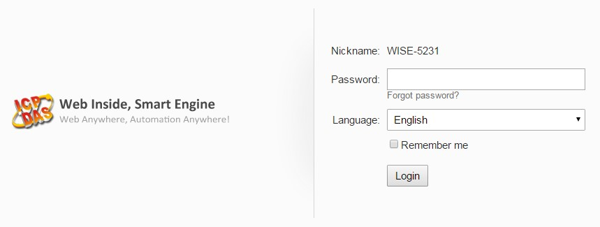

-   Go to the "Microsoft Azure Setting" page.

    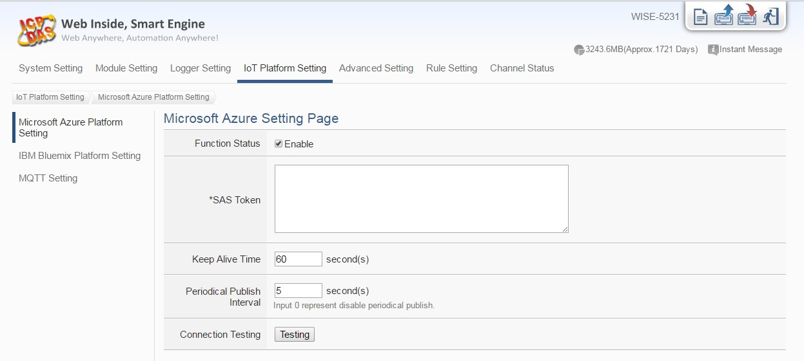

-   Input the SAS Token generated by Device Explorer.

    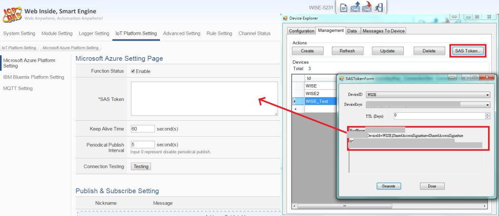

-   Edit the Message to send.

    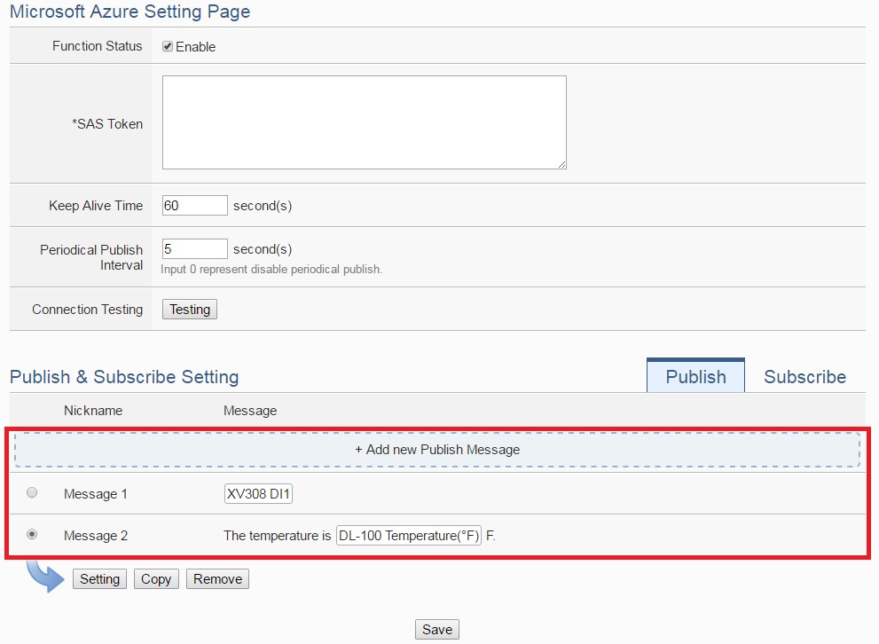

-   Click the Save button and write the settings to WISE-5231.

    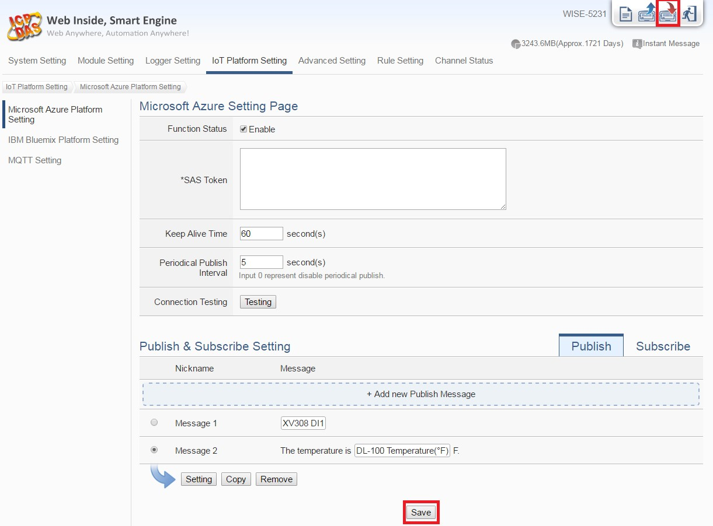

-   Use the DeviceExplorer utility to observe the messages IoT Hub receives from WISE-5231.

    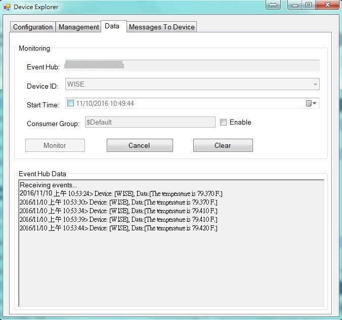

-   Use the DeviceExplorer utility to send the messages to WISE-5231.

    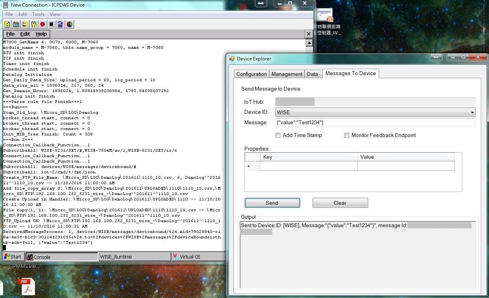

## Option 2: Use the WISE Monitoring IoT Kit from ICP DAS

### Setup ICP DAS WISE Monitoring IoT Kit

Connect the modules as bellow provided by the IoT kit.

- 	WISE-5231: Industrial IoT Concentrator

	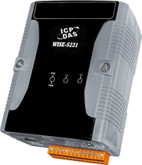

- 	tM-P3R3: 3-channel Digital Input and 3-channel Relay Output Module

	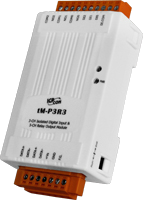

- 	DL-100tM-485: Temperature and Humidity Module

	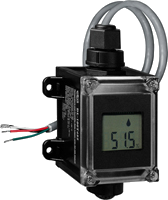

- 	MDR-20-24: 24W Industrial Power Supply

	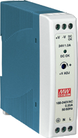

- 	LED Indicator (RED)

	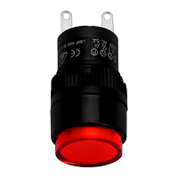

- 	Switch

	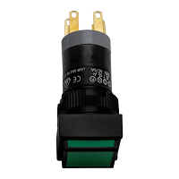

- 	Power cable

	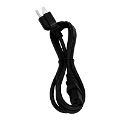

1.	Please refer to the figure as below to complete the wiring of RS-485 communication.

	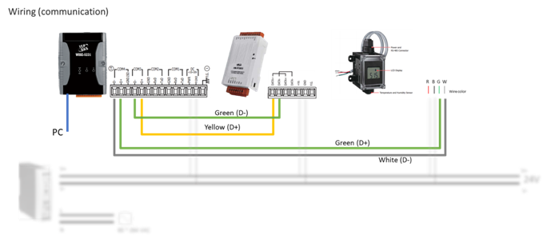

2.	Please refer to the figure as below for the wiring of power.

	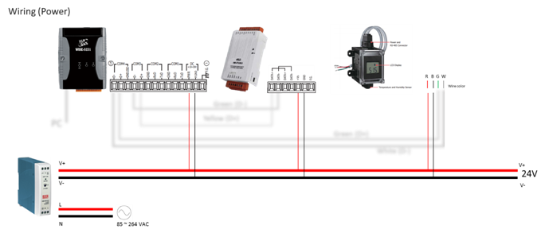

3.	Please refer to the figure as below for the wiring of LED and Switch.

	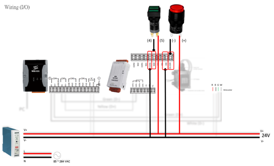

4.	After you've completed the wiring, the configuration will be the same as below.

	

### Prepare your Device

- Follow the instruction described in this [Quick Start](http://wise.icpdas.com/downloads/manual/WISE-52xx_quick%20start_v1.0.3.pdf) to Connect to the Web interface of WISE-5231.

- Follow the instruction described in this [User Manual](http://www.icpdas.com/root/product/solutions/datasheet/tm-series/tM-Series_DIO_User_Manual.pdf) to set tM-P3R3 and Module parameters as follows: 
	- Serial port parameters: 19200 N,8,1 (Default)
	- Modbus Address:1 (Default) 
	
- Follow the instruction described in this [User Manual](http://ftp.icpdas.com/pub/cd/usbcd/napdos/dl_100/dl100tm485/documents/dl100tm485_quick_start_v101.pdf) to set DL-100tM485 and Module parameters as follows:	
	- Serial port parameters: 19200 N,8,1 (Default)
	- Modbus Address:1 (Default) 

### Run the Sample

1.	Connect to WISE-5231 web server via browser, login with the default password "**Admin**".

	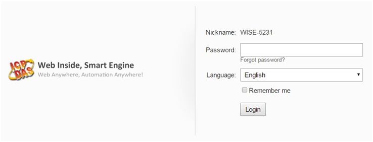

2.	Go to the "**System setting** >> **COM Port Interface Setting**" page to complete the setting of COM3 and COM4.

	

3.	Go to the "**Module Setting** >> **Remote I/O Module Setting**" page to add tM-P3R3 in COM3, and add DL-100 in COM4.

	

4.	Complete the setting and download the setting to WISE-5231, and then go to the "**Channel Status**" page to check the module communication status.

	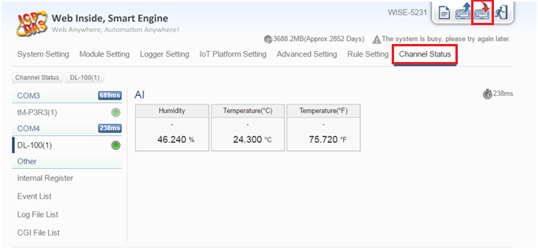

5.	Go to the "**Microsoft Azure Platform Setting**" page.

	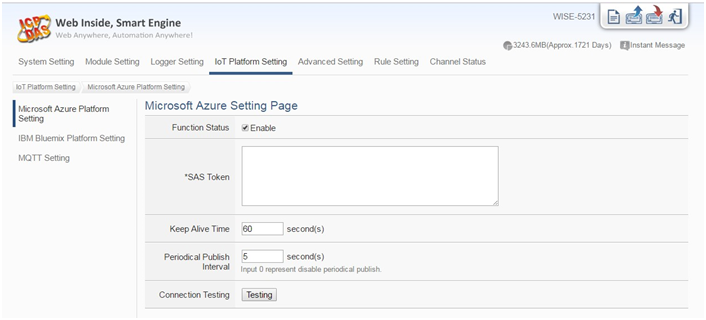

6.	Input the SAS Token generated by Device Explorer. (please refer previous section)

	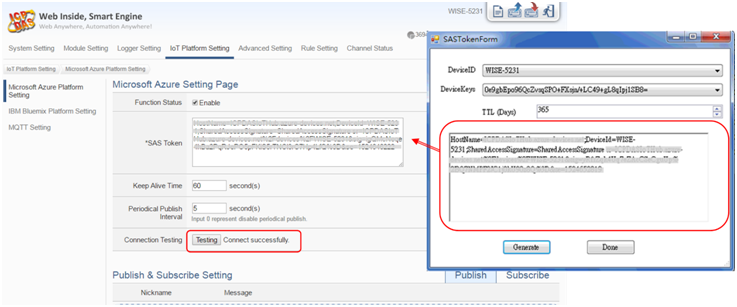

7.	Complete the Publish Message editing.

	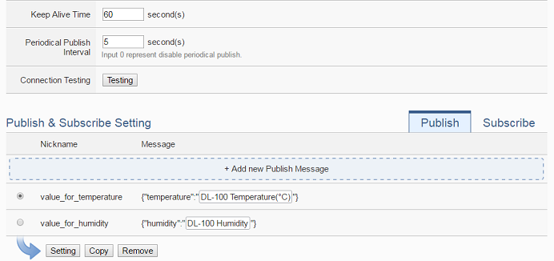

8.	Complete the Subscribe Message editing and click the "**Save**" button to save the settings.

	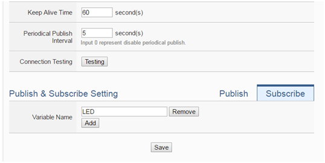

9.	Go to the "**Rule Setting**" page to add a rule to turn the relay on when receive the message from Azure, then remember to download the setting to WISE-5231.

	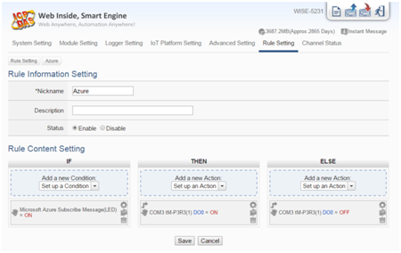

10.	Use the Device Explorer utility to verify if the IoT Hub receives the messages from WISE-5231.

	

11.	Go to the "**Channel Status**" page to observe that the LED status changes when WISE-5231 gets the message send by Device Explorer.

	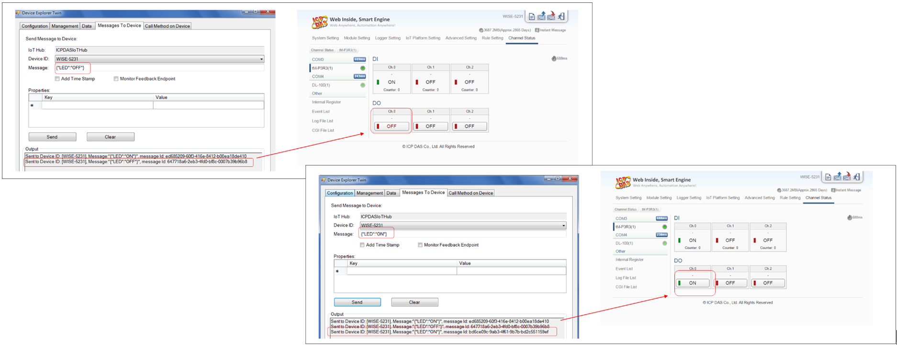

## Resource

-   [ICP DAS WISE Monitoring IoT Kit URL: http://wise.icpdas.com/products/WISE_IoTKit_01.html](http://wise.icpdas.com/products/WISE_IoTKit_01.html)

-   [Microsoft Azure IoT Starter Kits URL: http://aka.ms/iotstarterkits](http://aka.ms/iotstarterkits)

# Next Steps

You have now learned how to run a sample application that collects sensor data and sends it to your IoT hub. To explore how to store, analyze and visualize the data from this application in Azure using a variety of different services, please click on the following lessons:

-   [Manage cloud device messaging with iothub-explorer]
-   [Save IoT Hub messages to Azure data storage]
-   [Use Power BI to visualize real-time sensor data from Azure IoT Hub]
-   [Use Azure Web Apps to visualize real-time sensor data from Azure IoT Hub]
-   [Weather forecast using the sensor data from your IoT hub in Azure Machine Learning]
-   [Remote monitoring and notifications with Logic Apps]   

[Manage cloud device messaging with iothub-explorer]: https://docs.microsoft.com/en-us/azure/iot-hub/iot-hub-explorer-cloud-device-messaging
[Save IoT Hub messages to Azure data storage]: https://docs.microsoft.com/en-us/azure/iot-hub/iot-hub-store-data-in-azure-table-storage
[Use Power BI to visualize real-time sensor data from Azure IoT Hub]: https://docs.microsoft.com/en-us/azure/iot-hub/iot-hub-live-data-visualization-in-power-bi
[Use Azure Web Apps to visualize real-time sensor data from Azure IoT Hub]: https://docs.microsoft.com/en-us/azure/iot-hub/iot-hub-live-data-visualization-in-web-apps
[Weather forecast using the sensor data from your IoT hub in Azure Machine Learning]: https://docs.microsoft.com/en-us/azure/iot-hub/iot-hub-weather-forecast-machine-learning
[Remote monitoring and notifications with Logic Apps]: https://docs.microsoft.com/en-us/azure/iot-hub/iot-hub-monitoring-notifications-with-azure-logic-apps
[lnk-setup-iot-hub]: ../setup_iothub.md
[lnk-manage-iot-hub]: ../manage_iot_hub.md
