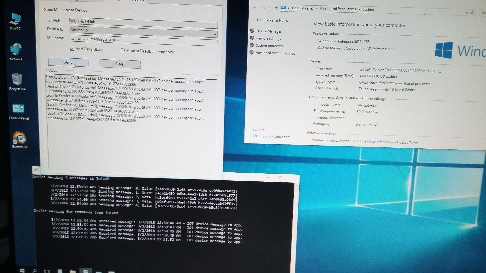

Run a simple Csharp sample on SP-7256 device running Windows 10 IoT Enterprise
===
---

# Table of Contents

-   [Introduction](#Introduction)
-   [Step 1: Prerequisites](#Prerequisites)
-   [Step 2: Prepare your Device](#PrepareDevice)
-   [Step 3: Build and Run the Sample](#Build)
-   [Next Steps](#NextSteps)

# Introduction

**About this document**

This document describes how to connect SP-7256 device running Windows 10 IoT Enterprise with Azure IoT SDK. This multi-step process includes:
-   Configuring Azure IoT Hub
-   Registering your IoT device
-   Build and deploy Azure IoT SDK on device

# Step 1: Prerequisites

You should have the following items ready before beginning the process:

-   [Prepare your development environment][setup-devbox-windows]
-   [Setup your IoT hub][lnk-setup-iot-hub]
-   [Provision your device and get its credentials][lnk-manage-iot-hub]
-   SP-7256 device.

# Step 2: Prepare your Device

-   Power on SP-7256 (Windows 10 Enterprise).
-   Connect the device to network to use Internet access.
-   Follow the instructions link: <http://www.protech.com.tw/supportzone/New/SP-7256/SP-7256_EDM.PDF>

# Step 3: Build and Run the sample

## 3.1 Connect the Device

-   Connect the SP-7256 to your network using an Ethernet cable. This step is required, as the sample depends on internet access

## 3.2 Build the Samples
-   Download the [Azure IoT SDK](https://github.com/Azure/azure-iot-sdk-csharp) and the sample programs and save them to your local repository.
-   Follow the download link: <https://github.com/Azure/azure-iot-sdks>
-   Connect your device to your IoT hub using .NET, please link to the <https://docs.microsoft.com/zh-tw/azure/tutorial> for this example.
-   Start a new instance of Visual Studio 2015, and load the **sample** solution.
-   Open the iothubcsharpclient.sln solution in the csharp\device folder in your local copy of the repository.
-   In Visual Studio, from Solution Explorer, navigate to the **samples** folder.
-   In the DeviceClientSample project, open the **program.cs** file.

-   Locate the following code in the file:

        private const string DeviceConnectionString = "<replace>";

-   Replace <replace> with the connection string for your device.
-   In Solution Explorer, right-click the **DeviceClientSample** project, click Debug, and then click Start new instance to build and run the sample. The console displays messages as the application sends device-to-cloud messages to IoT Hub.

## 3.3 Run and Validate the Samples
### 3.3.1 Send Device Events to IoT Hub

-   Use the DeviceExplorer utility to observe the messages IoT Hub receives from the Device Client Sample application.
-   Refer "Monitor device-to-cloud events" in [DeviceExplorer Usage document](https://github.com/Azure/azure-iot-sdk-csharp/blob/master/tools/DeviceExplorer/doc/how_to_use_device_explorer.md) to see the data your device is sending.

 

### 3.3.2 Receive messages from IoT Hub

-   Use the DeviceExplorer utility to send messages to the Device Client Sample application from IoT Hub sent.
-   Refer "Send cloud-to-device messages" in [DeviceExplorer Usage document](https://github.com/Azure/azure-iot-sdk-csharp/blob/master/tools/DeviceExplorer/doc/how_to_use_device_explorer.md) for instructions on sending messages to device.

# Next Steps

You have now learned how to run a sample application that collects sensor data and sends it to your IoT hub. To explore how to store, analyze and visualize the data from this application in Azure using a variety of different services, please click on the following lessons:

-   [Manage cloud device messaging with iothub-explorer]
-   [Save IoT Hub messages to Azure data storage]
-   [Use Power BI to visualize real-time sensor data from Azure IoT Hub]
-   [Use Azure Web Apps to visualize real-time sensor data from Azure IoT Hub]
-   [Weather forecast using the sensor data from your IoT hub in Azure Machine Learning]
-   [Remote monitoring and notifications with Logic Apps]   

[Manage cloud device messaging with iothub-explorer]: https://docs.microsoft.com/en-us/azure/iot-hub/iot-hub-explorer-cloud-device-messaging
[Save IoT Hub messages to Azure data storage]: https://docs.microsoft.com/en-us/azure/iot-hub/iot-hub-store-data-in-azure-table-storage
[Use Power BI to visualize real-time sensor data from Azure IoT Hub]: https://docs.microsoft.com/en-us/azure/iot-hub/iot-hub-live-data-visualization-in-power-bi
[Use Azure Web Apps to visualize real-time sensor data from Azure IoT Hub]: https://docs.microsoft.com/en-us/azure/iot-hub/iot-hub-live-data-visualization-in-web-apps
[Weather forecast using the sensor data from your IoT hub in Azure Machine Learning]: https://docs.microsoft.com/en-us/azure/iot-hub/iot-hub-weather-forecast-machine-learning
[Remote monitoring and notifications with Logic Apps]: https://docs.microsoft.com/en-us/azure/iot-hub/iot-hub-monitoring-notifications-with-azure-logic-apps
[setup-devbox-windows]: https://github.com/Azure/azure-iot-sdk-c/blob/master/doc/devbox_setup.md
[lnk-setup-iot-hub]: ../setup_iothub.md
[lnk-manage-iot-hub]: ../manage_iot_hub.md
