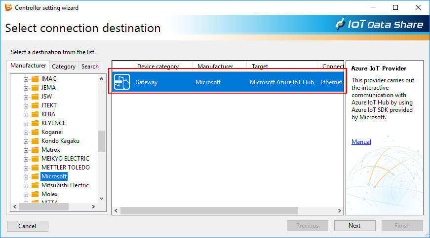
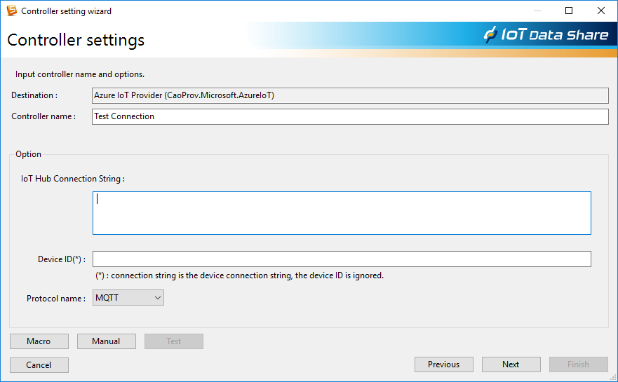
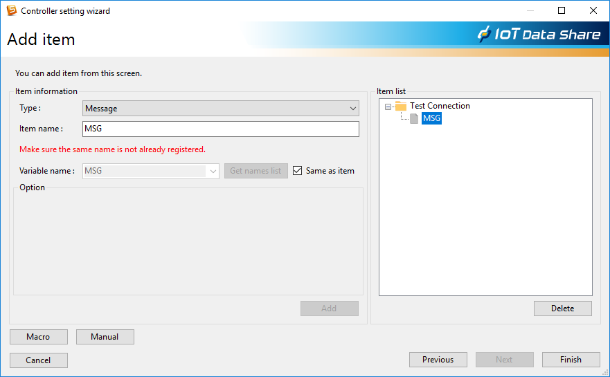
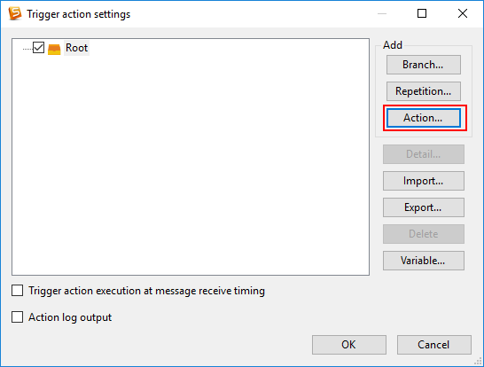
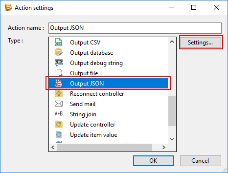
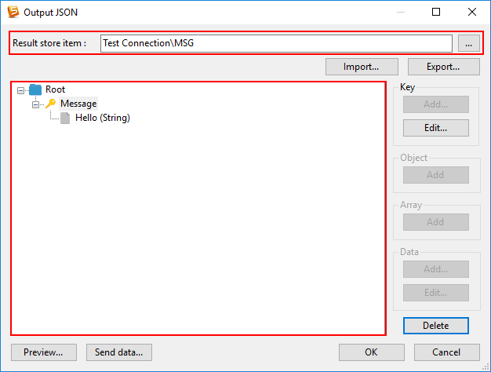

Run a simple Csharp sample on IoT Data Server device running Windows 10 IoT Enterprise 2016
===
---

# Table of Contents

-   [Introduction](#Introduction)
-   [Step 1: Prerequisites](#Prerequisites)
-   [Step 2: Prepare your Device](#PrepareDevice)
-   [Step 3: Build and Run the Sample](#Build)
-   [Next Steps](#NextSteps)

# Introduction

**About this document**

This document describes how to connect IoT Data Server device running Windows 10 IoT Enterprise 2016 LTSB with Azure IoT SDK. This multi-step process includes:
-   Configuring Azure IoT Hub
-   Registering your IoT device
-   Build and deploy Azure IoT SDK on device

# Step 1: Prerequisites

You should have the following items ready before beginning the process:

-   [Setup your IoT hub][lnk-setup-iot-hub]
-   [Provision your device and get its credentials][lnk-manage-iot-hub]
-   IoT Data Server device.

# Step 2: Prepare your Device

-   If you use HTTP protocol to communicate with IoT Hub via proxy, you have to configure proxy. Select `System settings`-`Network`-`Proxy`, and input your proxy server and port number.

# Step 3: Build and Run the sample

-   Click `Project Edit`

-   Right-click `project` in the lefthand window. Select `Controller setting wizard`.

-   Select `Manufactuer`-`Microsoft`-`Azure IoT Provider`, and click `Next`.

-   Input 'Controller name' and 'IoT Hub Connection String' and select 'Protocol Name'. Click 'Next'.

-   input `Item name` , check `Same as item` and click `add`. Click `Finish`.

-  Click your item, and change attribute from `Read` to `Write`.

-  Create another controller, right-click and select `Trigger settings`. Click `Action...`

-  Select `Output JSON`, and click `Settings...`

-  Select Azure IoT Hub Controller Item in `Result store item`, and create JSON formatted message.

-  Start project.

-   Use the **DeviceExplorer** utility to observe the messages IoT Hub receives from the **Device Client Sample** application.
-   Refer "Monitor device-to-cloud events" in [DeviceExplorer Usage document](https://github.com/Azure/azure-iot-sdk-csharp/blob/master/tools/DeviceExplorer/doc/how_to_use_device_explorer.md) to see the data your device is sending.
-   Refer "Send cloud-to-device messages" in [DeviceExplorer Usage document](https://github.com/Azure/azure-iot-sdk-csharp/blob/master/tools/DeviceExplorer/doc/how_to_use_device_explorer.md) for instructions on sending messages to device.

# Next Steps

You have now learned how to run a sample application that collects sensor data and sends it to your IoT hub. To explore how to store, analyze and visualize the data from this application in Azure using a variety of different services, please click on the following lessons:

-   [Manage cloud device messaging with iothub-explorer]
-   [Save IoT Hub messages to Azure data storage]
-   [Use Power BI to visualize real-time sensor data from Azure IoT Hub]
-   [Use Azure Web Apps to visualize real-time sensor data from Azure IoT Hub]
-   [Weather forecast using the sensor data from your IoT hub in Azure Machine Learning]
-   [Remote monitoring and notifications with Logic Apps]   

[Manage cloud device messaging with iothub-explorer]: https://docs.microsoft.com/en-us/azure/iot-hub/iot-hub-explorer-cloud-device-messaging
[Save IoT Hub messages to Azure data storage]: https://docs.microsoft.com/en-us/azure/iot-hub/iot-hub-store-data-in-azure-table-storage
[Use Power BI to visualize real-time sensor data from Azure IoT Hub]: https://docs.microsoft.com/en-us/azure/iot-hub/iot-hub-live-data-visualization-in-power-bi
[Use Azure Web Apps to visualize real-time sensor data from Azure IoT Hub]: https://docs.microsoft.com/en-us/azure/iot-hub/iot-hub-live-data-visualization-in-web-apps
[Weather forecast using the sensor data from your IoT hub in Azure Machine Learning]: https://docs.microsoft.com/en-us/azure/iot-hub/iot-hub-weather-forecast-machine-learning
[Remote monitoring and notifications with Logic Apps]: https://docs.microsoft.com/en-us/azure/iot-hub/iot-hub-monitoring-notifications-with-azure-logic-apps
[setup-devbox-windows]: https://github.com/Azure/azure-iot-sdk-csharp/blob/master/doc/devbox_setup.md
[lnk-setup-iot-hub]: ../setup_iothub.md
[lnk-manage-iot-hub]: ../manage_iot_hub.md
