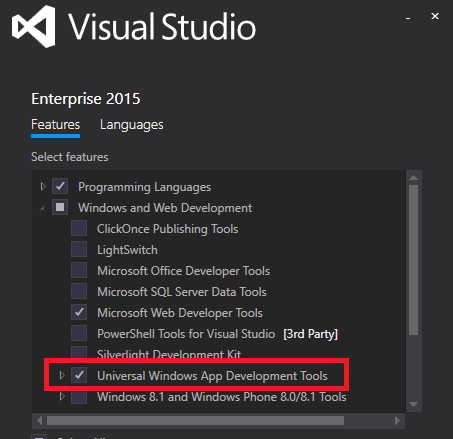
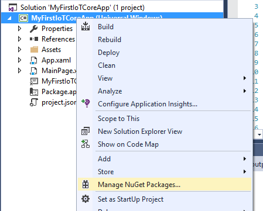
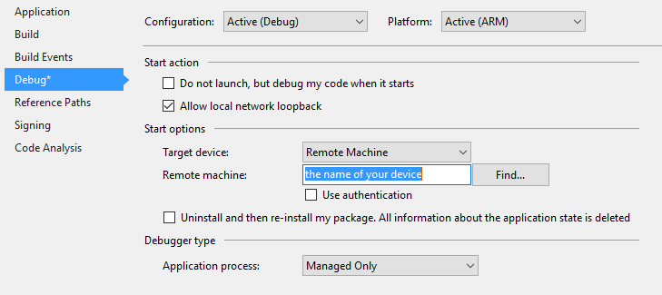
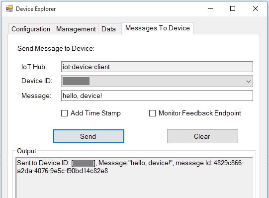

Run a simple Csharp sample on device running Windows 10 IoT Core
===
---

# Table of Contents

-   [Introduction](#Introduction)
-   [Step 1: Prerequisites](#Prerequisites)
-   [Step 2: Prepare your Device](#PrepareDevice)
-   [Step 3: Build and Run the Sample](#Build)
-   [Next Steps](#NextSteps)

# Introduction

**About this document**

This step-by-step guide will allow you to familiarize yourself with Windows 10 IoT Core platform, set up your device and create your first application that connects to Azure IoT Hub.

You can leverage the power of the Windows platform and Visual Studio to create innovative solutions on a variety of devices running Windows 10 IoT Core.

# Step 1: Prerequisites

Before you get started, you should:

-   [Setup your IoT hub][lnk-setup-iot-hub]
-   [Provision your device and get its credentials][lnk-manage-iot-hub]

# Step 2: Prepare your Device

First of all, you need to set up your device.

- If you’re using Raspberry Pi, set up your device according to instructions [here](https://developer.microsoft.com/en-us/windows/iot/getstarted).
- If you’re using MinnowBoard Max set up your device according to instructions [here](https://developer.microsoft.com/en-us/windows/iot/getstarted).
- If you’re using Dragonboard setup instructions should come soon [here](https://developer.microsoft.com/en-us/windows/iot/getstarted).

> Note: We recommend using the RTM version of Windows 10 IoT Core unless there is a specific feature in a Windows 10 Insider Preview version that you want to use.

# Step 3: Build and Run the sample

## Install Visual Studio 2015 and Tools

To create Windows IoT Core solutions, you will need to install [Visual Studio 2015](https://www.visualstudio.com/products/vs-2015-product-editions.aspx). You can install any edition of Visual Studio, including the free Community edition.

Make sure to select the **Universal Windows App Development Tools**, the component required for writing apps Windows 10:

## Create a Visual Studio UWP Solution

UWP (Universal Windows Platform) is an evolution of Windows application model introduced in Windows 8. UWP provides a common app platform available on every device that runs Windows 10, including the IoT Core.

To create a UWP solution in Visual Studio, on the **File** menu, click **New** then **Project**:

In the New Project dialog that comes up, select **Blank App (Universal Windows) Visual C#**. Give your project a name, for example **MyFirstIoTCoreApp**:

## Get Microsoft.Azure.Devices.Client Library

Once the project has been created, we need to include a reference to the Microsoft.Azure.Devices.Client library -- this is the component that contains the functionality necessary to connect to Azure IoT Hub.

In **Solution Explorer**, right-click on the solution and select **Manage NuGet Packages**:

The NuGet Package Manager will open. Make sure to select **Include prerelease**. Find the package named **Microsoft.Azure.Devices.Client** and click **Install**:  

On the **Review Changes** dialog, click **OK**, then accept the license terms. The package is downloaded and added to your project.

## Build and run the Device Explorer tool

You can use the Device Explorer sample application on your Windows desktop machine to create and register a device ID and symmetric key for your device. The Device Explorer interfaces with Azure IoT Hubs, and has some basic capabilities. For more info, check out [How to use Device Explorer][device-explorer].

- **Device management**: creates device IDs and obtains a list of registered devices on your IoT Hub.
- **Monitors and consumes data** sent by your devices to your IoT Hub.
- **Sends messages** to your devices.

## Sample 1: Sending Data to Azure IoT Hub

At last, you can start writing code! Open the file named **MainPage.xaml.cs** and add a few `using` directives:

    using System.Text;
    using System.Threading.Tasks;
    using Microsoft.Azure.Devices.Client;

In our first sample, we will try to send a simple string to Azure IoT Hub.

Add the following function to class `MainPage`:

    private async Task SendDataToAzure()
    {
        DeviceClient deviceClient = DeviceClient.CreateFromConnectionString("<replace>", TransportType.Http1);

        var text = "Hellow, Windows 10!";
        var msg = new Message(Encoding.UTF8.GetBytes(text));

        await deviceClient.SendEventAsync(msg);
    }

### Using The Real Connection String

Important: remember to replace the `"<replace>"` string in the above snippet with the actual connection string. To get the connection string for your device, return the Device Explorer **Management** tab, find your device in the list, right-click on it and select **Copy connection string for selected device**. Now paste this string into your code, replacing the string `"<replace>"`.

This string gives you access to the service, so remember to keep it secret -- in particular, you don't want to check it into your source control system, especially if you project is open source.

### Build and Run

Finally, it's time to run the app! Add the call to the function `SendDataToAzure` from the constructor of the `MainPage` class:

Now choose the right architecture (x86 or ARM, depending on your device) and set the debugging method to **Remote Machine**:

If you're using a Raspberry Pi device, select ARM. For other supported devices, consult [windowsondevices.com](http://www.windowsondevices.com).

You will need to deploy your app to an IoT device so that you can run and debug it remotely. Right-click on the solution in Solution Explorer, select **Properties** and navigate to the **Debug** tab:

Type in the name of your device. Make sure the **Use authentication** box is unchecked.

Now, you're ready to build and deploy the app. Choose **Build** and then **Deploy** from the top menu.

Hit F5 to run the app. It might take a few second for the app to start.  

> Note: For more information about deploying and debugging your code on a device, see the ["Hello, World!" Sample][hello-sample] for IoT on the [Windows Dev Center][iot-dev-center].

## Validate Your Solution

Use the Device Explorer to inspect data coming to Azure IoT Hub and manage devices.

Navigate to the **Data** tab in the Device Explorer and make sure you see "Hello, Windows 10" string there:

Congratulations! You have successfully sent your string to Azure IoT Hub.

## Sample 2: Receiving Data from Azure IoT Hub

In this sample, we will learn how to receive data from Azure IoT Hub. Define the function `ReceiveDataFromAzure` as follows:

    public async static Task ReceiveDataFromAzure()
    {
        DeviceClient deviceClient = DeviceClient.CreateFromConnectionString("<replace>", TransportType.Http1);

        Message receivedMessage;
        string messageData;

        while (true)
        {
            receivedMessage = await deviceClient.ReceiveAsync();

            if (receivedMessage != null)
            {
                messageData = Encoding.ASCII.GetString(receivedMessage.GetBytes());
                await deviceClient.CompleteAsync(receivedMessage);
            }
        }
    }

This function can be invoked from `MainPage` similarly to how we did in the previous example.

    public MainPage()
    {
        this.InitializeComponent();
        ReceiveDataFromAzure();
    }

Now, before you run the app, switch to the Device Explorer and open the Message To Device tab:

Select your device in the Device ID list, and type "hello, device!" in the Message box. Hit Send.

Now set the breakpoint at the `await` statement and start the application. When the control reaches the breakpoint, you should see the value of `messageData` as "hello, device!":

Congratulations! You have successfully received your string from Azure IoT Hub.

# Next Steps

You have now learned how to run a sample application that collects sensor data and sends it to your IoT hub. To explore how to store, analyze and visualize the data from this application in Azure using a variety of different services, please click on the following lessons:

-   [Manage cloud device messaging with iothub-explorer]
-   [Save IoT Hub messages to Azure data storage]
-   [Use Power BI to visualize real-time sensor data from Azure IoT Hub]
-   [Use Azure Web Apps to visualize real-time sensor data from Azure IoT Hub]
-   [Weather forecast using the sensor data from your IoT hub in Azure Machine Learning]
-   [Remote monitoring and notifications with Logic Apps]   

[Manage cloud device messaging with iothub-explorer]: https://docs.microsoft.com/en-us/azure/iot-hub/iot-hub-explorer-cloud-device-messaging
[Save IoT Hub messages to Azure data storage]: https://docs.microsoft.com/en-us/azure/iot-hub/iot-hub-store-data-in-azure-table-storage
[Use Power BI to visualize real-time sensor data from Azure IoT Hub]: https://docs.microsoft.com/en-us/azure/iot-hub/iot-hub-live-data-visualization-in-power-bi
[Use Azure Web Apps to visualize real-time sensor data from Azure IoT Hub]: https://docs.microsoft.com/en-us/azure/iot-hub/iot-hub-live-data-visualization-in-web-apps
[Weather forecast using the sensor data from your IoT hub in Azure Machine Learning]: https://docs.microsoft.com/en-us/azure/iot-hub/iot-hub-weather-forecast-machine-learning
[Remote monitoring and notifications with Logic Apps]: https://docs.microsoft.com/en-us/azure/iot-hub/iot-hub-monitoring-notifications-with-azure-logic-apps
[device-explorer]: ../../tools/DeviceExplorer/doc/how_to_use_device_explorer.md
[hello-sample]: http://ms-iot.github.io/content/win10/samples/HelloWorld.htm
[iot-dev-center]: https://dev.windows.com/iot
[lnk-setup-iot-hub]: ../setup_iothub.md
[lnk-manage-iot-hub]: ../manage_iot_hub.md

