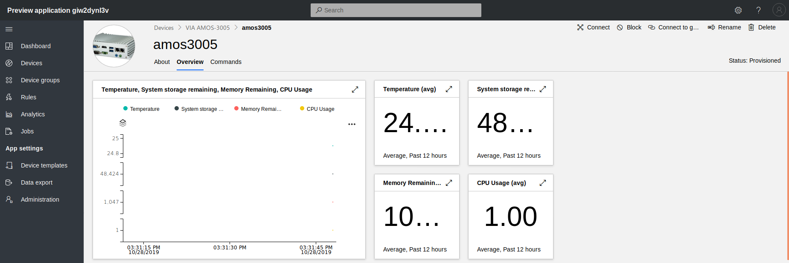

Connect VIA AMOS-3005 device to your Azure IoT Central Application
===

---
# Table of Contents

-   [Introduction](#Introduction)
-   [Prerequisites](#Prerequisites)
-   [Create Azure IoT Central application](#Create_AICA)
-   [Device Connection Details](#DeviceConnectionDetails)
-   [Prepare the Device](#preparethedevice)
-   [Integration with IoT Central](#IntegrationwithIoTCentral)
-   [Additional Links](#AdditionalLinks)

<a name="Introduction"></a>
# Introduction 

**About this document**

This document describes how to connect VIA AMOS-3005 to Azure IoT Central application using the IoT plug and Play model. Plug and Play simplifies IoT by allowing solution developers to integrate devices without writing any device code. Using Plug and Play, device manufacturers will provide a model of their device to cloud developers to be integrated quickly into IoT Central or any solution built on the Azure IoT platform. IoT Plug and Play will be open to the community by way of a definition language and SDKs.

Speed up your commercial and industrial IoT and edge intelligence installations with the VIA AMOS-3005. This compact and ruggedized fanless system is designed to meet the most demanding indoor and outdoor operational requirements and can be customized for a host of smart building management, monitoring and surveillance, remote energy management, and smart kiosk applications.

In addition to supporting a wide operating temperature range from -20°C to 60°C and a wide voltage input from 9-36V, the VIA AMOS-3005 also offers rich array of networking, connectivity, and I/O features, including dual Gigabit Ethernet, two COM ports, and Wi-Fi and dual 3G SIM card support.

<a name="Prerequisites"></a>
# Prerequisites

You should have the following items ready before beginning the process: 

-   [Azure Account](https://portal.azure.com)
-   [Azure IoT Hub Instance](https://docs.microsoft.com/en-us/azure/iot-hub/about-iot-hub)
-   [Azure IoT Hub Device Provisioning Service](https://docs.microsoft.com/en-us/azure/iot-dps/about-iot-dps)
-   Provide Network connectivity (Wifi, LAN) supported by the device

<a name="preparethedevice"></a>
# Prepare the Device.

Hardware Environmental setup

- Prepare VIA AMOS-3005 and connect with HDMI, 12V DC adapter, Ethernet and your modbus device.

Software Environmental Setup 

-   Download and install [Ubuntu 16.04](http://releases.ubuntu.com/xenial/).
-   Download the [Azure IoT PnP Software](http://cdn.viaembedded.com/products/software/amos-3005/Azure_IoT_PnP/VIA-AMOS3005-PnP-Package.tgz) from [VIA AMOS-3005 Downloads](https://www.viatech.com/en/systems/industrial-fanless-pcs/amos-3005/).


-   Copy the **VIA-AMOS3005-PnP-Package.tgz** to VIA AMOS-3005 and extract the package by the command:

    ```bash
    $ tar zxvf VIA-AMOS3005-PnP-Package.tgz
    ```
-   Install third-party library
 
   ```bash
    $ sudo apt-get install libssl-dev
    ```
<a name="IntegrationwithIoTCentral"></a>
# Integration with IoT Central

Azure IoT Central Setup

-   Create an **Azure IoT Central accout** and launch the **public preview** application.
-   Click ***Administaration -> Device Connection -> Certificates (X.509)***.
-   Upload and verify your certificate.
-   Generate a device **certificate**, **private key** and remember your **Common Name** and **Scope Id**.
-   Click ***Device templates -> + New***. Choose pre-certified device **"VIA AMOS-3005"**.

**VIA AMOS-3005 Setup**

-   Copy your device **certificate** and **private key** to ***VIA-AMOS3005-PnP-Package/Certificate*** folder and rename as **device-ca.pem** and **device-key.pem**, respectively. 
-   Modify the device-name and scope-id in **VIA-AMOS3005-PnP-Package/pnp.conf** to yours. The device-name is your certificate **Common Name** and scope-id is your **Azure IoT Central Scope Id**.
-   Change directory to VIA-AMOS3005-PnP-Package and start the program by the command: 
    ```bash
    $ sudo ./start.sh
    ```

Check Azure IoT Central
-   Clicks ***Devices***, and you can see that your VIA AMOS-3005 register to IoT Central.
-   Click your VIA AMOS-3005. You can see the messages from VIA AMOS-3005 



<a name="AdditionalLinks"></a>
# Additional Links

Please refer to the below link for additional information for Plug and Play 

-   [Blog](https://azure.microsoft.com/en-us/blog/iot-plug-and-play-is-now-available-in-preview/)
-   [FAQ](TBD) 
-   [Plug and Play C SDK](https://github.com/Azure/azure-iot-sdk-c/tree/public-preview) 
-   [Plug and Play Node SDK](https://github.com/Azure/azure-iot-sdk-node/tree/digitaltwins-preview)
-   [Plug and Play Definitions](https://github.com/Azure/IoTPlugandPlay)
