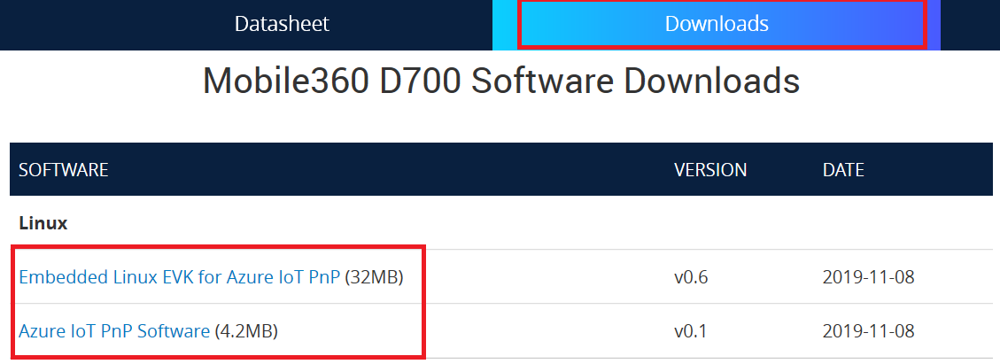

Connect VIA Mobile360 D700 device to your Azure IoT Central Application
===

---
# Table of Contents

-   [Introduction](#Introduction)
-   [Prerequisites](#Prerequisites)
-   [Create Azure IoT Central application](#Create_AICA)
-   [Device Connection Details](#DeviceConnectionDetails)
-   [Prepare the Device](#preparethedevice)
-   [Integration with IoT Central](#IntegrationwithIoTCentral)
-   [Additional Links](#AdditionalLinks)

# Introduction 

**About this document**

This document describes how to connect VIA Mobile360 D700 to Azure IoT Central application using the IoT plug and Play model. Plug and Play simplifies IoT by allowing solution developers to integrate devices without writing any device code. Using Plug and Play, device manufacturers will provide a model of their device to cloud developers to be integrated quickly into IoT Central or any solution built on the Azure IoT platform. IoT Plug and Play will be open to the community by way of a definition language and SDKs.

With its GPS, 4G LTE, Wi-Fi, and CAN bus support, the VIA Mobile360 D700 can feed detailed driver and vehicle telematics data to the cloud in real-time – providing actionable insights that allow you to boost operational efficiency by minimizing vehicle idle time, improve routing efficiency and asset utilization, and reduce costs from vehicle damage and fake insurance claims.

# Prerequisites

You should have the following items ready before beginning the process: 

-   [Azure Account](https://portal.azure.com)
-   [Azure IoT Hub Instance](https://docs.microsoft.com/en-us/azure/iot-hub/about-iot-hub)
-   [Azure IoT Hub Device Provisioning Service](https://docs.microsoft.com/en-us/azure/iot-dps/about-iot-dps)
-   Provide Network connectivity (Wifi, LAN) supported by the device

**Note:** If the device code is not preinstalled following are the [options](#preparethedevice) to choose to enable the plug and play device.

# Prepare the Device.

Hardware Environmental setup

-   Prepare VIA Mobile360 D700, 12V DC Adaptor, Micro USB and SD card.

Software Environmental Setup 

-   The image will pre-install in VIA Mobile360 D700. After you boot the device, VIA Mobile360 D700 can enter into system. If you want to get the EVK image for VIA Mobile360 D700, please download [Embedded Linux EVK for Azure IoT PnP](http://cdn.viaembedded.com/products/software/d700/Linux_EVK/FW96685A.bin) from [VIA Mobile360 D700 AI Dash Cam Downloads](https://www.viatech.com/en/systems/mobile360/mobile360-d700-ai-dash-cam/).

**How to update firmware**

1.  Format the SD card to FAT32. Put the FW96685A.bin in the SD card. And then plug the SD card to the board.
2.  Power on the board, the FW96685A.bin will be automatically upgraded to the SPI Nand Flash of the board.

-   Prepare teraterm or putty to check message with VIA Mobile360 D700.
-   Download [Azure IoT PnP Software](http://cdn.viaembedded.com/products/software/d700/Azure_IoT_PnP/VIA-Mobile360-D700-PnP-Package.tgz) from [VIA Mobile360 D700 AI Dash Cam Downloads](https://www.viatech.com/en/systems/mobile360/mobile360-d700-ai-dash-cam/).

-   Copy the Package into VIA Mobile360 D700 and extract the package

# Integration with IoT Central

**Azure IoT Central Setup**

-   Create Azure IoT Central account and launch public preview application
-   Click **"Administration" -> "Device Connection" -> "Certificates (X.509)"** Upload your certification and do verification
-   Click **"Device templates" -> "+ New"**. Choose pre-certified device "VIA Mobile360 D700"

**VIA Mobile360 D700**

-   Remount the filesystem with command:

        # mount -o rw,remount /

-   Copy the binary into /bin by this command:

        # cp VIA_Mobile360_D700_Package/Runtimes/bin/* /bin/

-   Copy your device certification and private key to VIA\_Mobile360\_D700\_Package/Certificate directory and rename as **device-ca.pem** and **device-key.pem** respectively.
-   Modify device name and scope-id in pnp.conf to yours. The device-name is common name in certification and scope ID is **Azure IoT Central scop ID**
-   Start the program by command:

        # ./start.sh  

**Check Azure IoT Central**
-   Click "Devices" and you can see that VIA\_Mobile360\_D700 register to IoT Central.
-   Click VIA\_Mobile360\_D700 and you can see the information with VIA Mobile360 D700

# Additional Links

Please refer to the below link for additional information for Plug and Play 

-   [Blog](https://azure.microsoft.com/en-us/blog/iot-plug-and-play-is-now-available-in-preview/)
-   [FAQ](TBD) 
-   [Plug and Play C SDK](https://github.com/Azure/azure-iot-sdk-c/tree/public-preview) 
-   [Plug and Play Node SDK](https://github.com/Azure/azure-iot-sdk-node/tree/digitaltwins-preview)
-   [Plug and Play Definitions](https://github.com/Azure/IoTPlugandPlay)

