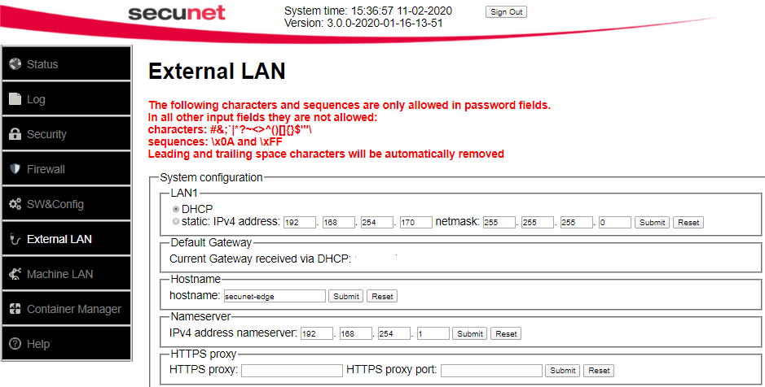
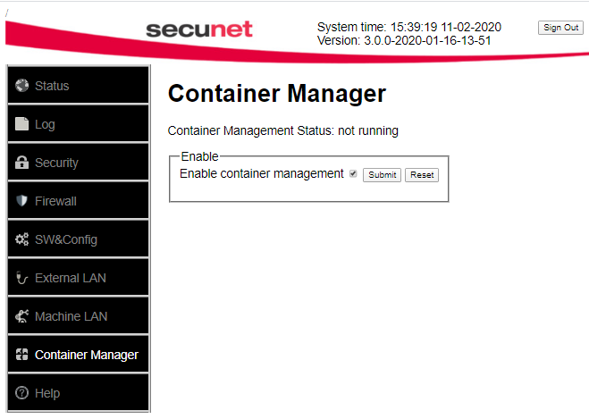

Run a simple sample application like the SimulatedTemperatureSensor on secunet edge extended device
===
---

# Table of Contents

-   [Introduction](#Introduction)
-   [Step 1: Prerequisites](#Prerequisites)
-   [Step 2: Prepare your Device](#PrepareDevice)
-   [Step 3: Manual Test for Azure IoT Edge on device](#Manual)

# Introduction

**About this document**

This document describes how to connect secunet edge extended device running a secure strong hardened operating system, with Azure IoT Edge Runtime pre-installed and Device Management. This multi-step process includes:

-   Configuring Azure IoT Hub
-   Registering your IoT device
-   Build and Deploy client component to test device management capability

This instruction describes also some differences between the original Azure IoT Edge tutorials.
For all steps on secunet edge extended no console access to the edge device is required.

# Step 1: Prerequisites

You should have the following items ready before beginning the process:

-   [Prepare your development environment][setup-devbox-linux]
-   [Setup your IoT hub](https://account.windowsazure.com/signup?offer=ms-azr-0044p)
-   [Provision your device and get its credentials][lnk-manage-iot-hub]
-   [Sign up to IOT Hub](https://account.windowsazure.com/signup?offer=ms-azr-0044p)
-   [Add the Edge Device](https://docs.microsoft.com/en-us/azure/iot-edge/quickstart-linux)
-   [Add the Edge Modules](https://docs.microsoft.com/en-us/azure/iot-edge/quickstart-linux#deploy-a-module)
-   secunet edge extended device
-   web browser

# Step 2: Prepare your Device

-   Connect secunet edge extended to power supply. The system starts automatically
-   Connect your PC via LAN to LAN port 4 of secunet edge extended
-   Configure your PC's IP address. Default IP address of secunet edge is 111.111.111.111
-   Open a web browser and enter the URL https://111.111.111.111:4444 , ignore the certificate warning
-   Login with user name "Admin" and default password "Secure Visibility", it's recommended to change user name and password
-   Choose profile 2 or 3
-   Configure the External LAN (LAN port 1) for internet connection
   
    

-   Enable the Container Management in Container Manager menu
  
    

-   In Container Manager go to menu Cloud container management
-   Enter your IoT Edge device Primary Connection String to field Device  Connection String and click setup

    

-   After some seconds log-information about setup will be shown, click ok in the end
   
    

-   secunet edge download and install now all modules and proceed all firewall settings

# Step 3: Managment Azure IoT Edge on device

This section walks you through the management features for Azure IoT Edge Runtime and the module deployments on secunet edge extended.

## 3.1 Edge Runtime

**Details of the requirement:**

The following components come pre-installed on the device to customer(s):

-   Azure IoT Edge Security Daemon
-   Daemon configuration file
-   Moby container management system
-   A version of `hsmlib` 

*Edge Runtime is now Enabled:*

**Check the iotedge status:** 

Go to the menue Container Manager --> Cloud container management on secunet edge extended, the status shows the Azure IoT edge Daemon is under running state

 

In the Container Manager, you can see the list and status of all the module deployed from the cloud are running on your IoT Edge device

  

For every installed module or container you can click on Show log to see the log file information.

On the device details page of the Azure, you should see the runtime modules - edgeAgent, edgeHub and tempSensor modueles are under running status

 

[setup-devbox-linux]: https://github.com/Azure/azure-iot-sdk-c/blob/master/doc/devbox_setup.md
[lnk-setup-iot-hub]: ../setup_iothub.md
[lnk-manage-iot-hub]: ../manage_iot_hub.md
