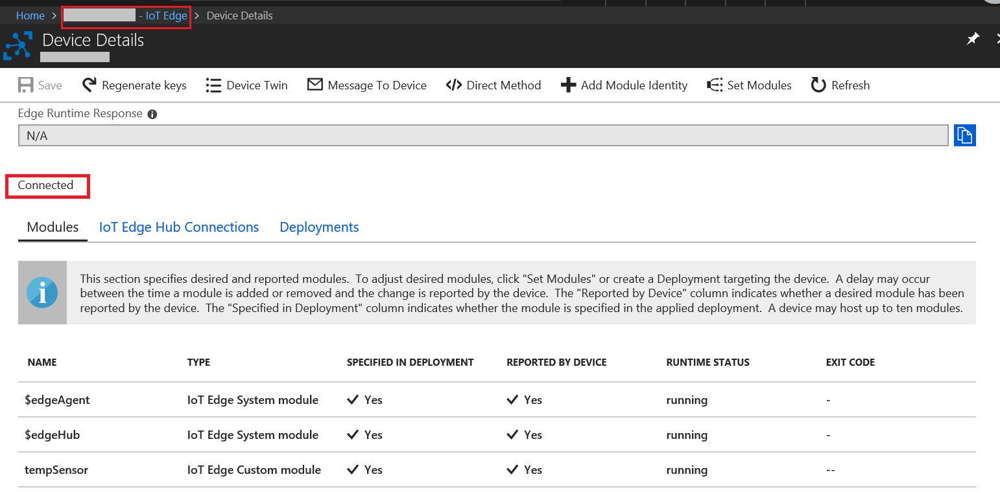

Run a simple Python sample on the AI and Edge Computing Kit running Yocto
===
---

# Table of Contents

-   [Introduction](#Introduction)
-   [Step 1: Prerequisites](#Prerequisites)
-   [Step 2: Prepare your Device](#PrepareDevice)
-   [Step 3: Manual Test for Azure IoT Edge](#Manual)
-   [Step 4: Next Steps](#NextSteps)

# Introduction

This document describes how to connect the AI and Edge Computing Kit with Azure IoT Edge Runtime pre-installed to an Azure IoT Hub. This multi-step process includes:

-   Configuring an Azure IoT Hub
-   Registering your IoT device
-   Build and Deploy IoT Edge modules

# Step 1: Prerequisites

You should have the following items ready before beginning the process:

-   [Prepare your development environment][setup-devbox-linux]
-   [Setup your IoT hub](https://account.windowsazure.com/signup?offer=ms-azr-0044p)
-   [Provision your device and get its credentials][lnk-manage-iot-hub]
-   [Sign up to IoT Hub](https://account.windowsazure.com/signup?offer=ms-azr-0044p)
-   [Add the Edge Device](https://docs.microsoft.com/en-us/azure/iot-edge/quickstart-linux)
-   [Add the Edge Modules](https://docs.microsoft.com/en-us/azure/iot-edge/quickstart-linux#deploy-a-module)
-   PHYTEC's AI and Edge Computing Kit
-   Display with HDMI input

# Step 2: Prepare your Device

1.  Connect the following components and cables (found in your kit):
    -   USB camera to the **front** USB port
    -   Input device (mouse or keyboard) to the **back** USB port
    -   Ethernet cable to a local area network with internet access
    -   Insert the SD card into the SD card slot
2.  Connect an HDMI display (not included) to the HDMI port
3.  Connect the 5 V power adapter (SV042) to power up the kit and begin the boot process

*Please note that all cables and devices need to be connected for the demo to function properly.*

Detailed instructions on preparing your device can also be found in the [quick-start guide](https://www.phytec.de/produkt/evaluierungskits/phycore-rk3288-data-ai-download/).

# Step 3: Manual Test for Azure IoT Edge

The AI and Edge Computing Kit comes pre-installed with the Azure IoT Edge runtime. This includes:

-   Azure IoT Edge Security Daemon
-   Daemon configuration file `/etc/iotedge/config.yaml`
-   Moby container management system
-   A version of `hsmlib`

To execute any commands on the edge device connect to it via a SSH session. Make sure that your workstation computer or laptop is on the same network with the edge device. By default the hostname of the edge device is `phycore-rk3288-4`:

    ssh root@phycore-rk3288-4

If you want, you can change the hostname by editing the file `/etc/hostname` and entering the desired hostname there.

First, enter the correct connection string in the Azure IoT Edge daemon configuration file. Detailed information can be found in the official Azure documentation in [Configure the security daemon](https://docs.microsoft.com/en-us/azure/iot-edge/how-to-install-iot-edge-linux#configure-the-security-daemon).

    vi /etc/iotedge/config.yaml

Start the Azure IoT Edge daemon:

    $ systemctl start iotedge

To start the Azure IoT Edge daemon on a reboot, enable the service:

    $ systemctl enable iotedge

Confirm that the Azure IoT Edge daemon is running. The property "Active" should have the value "active (running)".

    $ systemctl status iotedge
    ● iotedge.service - Azure IoT Edge daemon
    Loaded: loaded (/lib/systemd/system/iotedge.service; enabled; vendor preset: enabled)
    Active: active (running) since Tue 2019-08-20 12:03:33 UTC; 16min ago
     Docs: man:iotedged(8)
    Main PID: 3683 (iotedged)
    Tasks: 11 (limit: 4837) 
    Memory: 10.4M
    CGroup: /system.slice/iotedge.service
           └─3683 /usr/bin/iotedged -c /etc/iotedge/config.yaml

Open the command prompt on your IoT Edge device, confirm that the module deployed from the cloud is running on your IoT Edge device

Confirm that all modules are up and running:

    $ iotedge list
    NAME             STATUS           DESCRIPTION      CONFIG
    edgeAgent        running          Up 3 minutes     mcr.microsoft.com/azureiotedge-agent:1.0
    edgeHub          running          Up 2 minutes     mcr.microsoft.com/azureiotedge-hub:1.0
    tempSensor       running          Up 2 minutes     mcr.microsoft.com/azureiotedge-simulated-temperature-sensor:1.0

On the device details page of the Azure portal you should see all modules: edgeAgent, edgeHub and tempSensor modules are under running status.

 

# Step 4: Next steps

Information on deploying Custom Vision AI models can be found in the [Data Mining and AI Software Guide](https://www.phytec.de/documents/l-857ea0-data-mining-and-ai-software-guide/). If you want to develop your own modules and deploy them to the edge device, see the [Edge Computing Software Guide](https://www.phytec.de/documents/l-858ea0-edge-computing-software-guide/).

[setup-devbox-linux]: https://github.com/Azure/azure-iot-sdk-c/blob/master/doc/devbox_setup.md
[lnk-manage-iot-hub]: ../manage_iot_hub.md