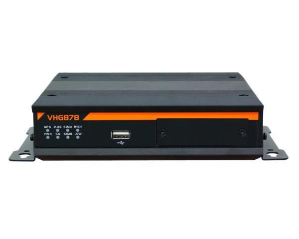
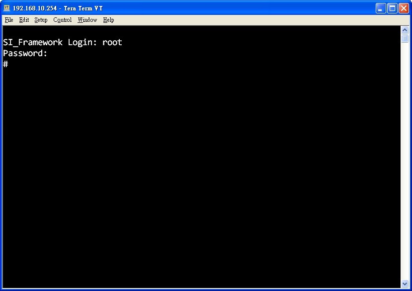
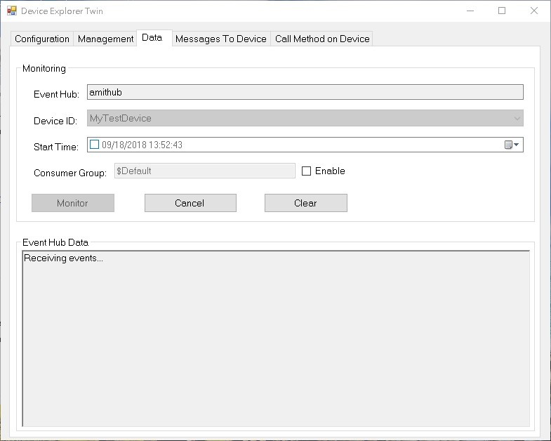
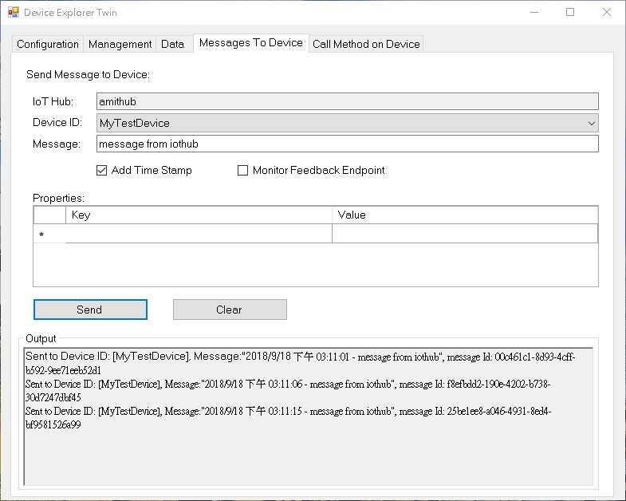
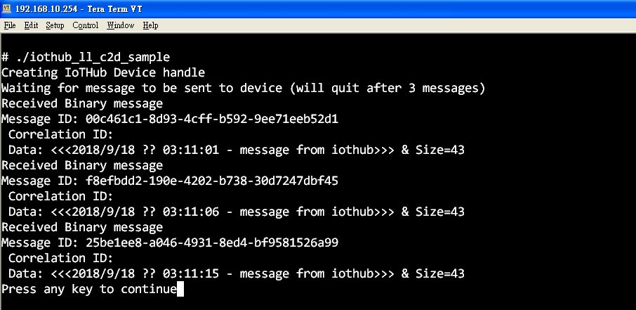

Run a simple C sample on VHG87B-0T1B0 device running Embedded Linux
===
---

# Table of Contents

-   [Introduction](#Introduction)
-   [Step 1: Prerequisites](#Prerequisites)
-   [Step 2: Prepare your Device](#PrepareDevice)
-   [Step 3: Build and Run the Sample](#Build)
-   [Next Steps](#NextSteps)

# Introduction

**About this document**

This document describes how to connect VHG87B-0T1B0 device running Embedded Linux with Azure IoT SDK. This multi-step process includes:
-   Configuring Azure IoT Hub
-   Registering your IoT device
-   Build and deploy Azure IoT SDK on device

# Step 1: Prerequisites

You should have the following items ready before beginning the process:

-   [Prepare your development environment][setup-devbox-linux]
-   [Setup your IoT hub][lnk-setup-iot-hub]
-   [Provision your device and get its credentials][lnk-manage-iot-hub]
-   VM Ubuntu14.04 
-   Cross compiler tools 
-   VHG87B-0T1B0 

 

# Step 2: Prepare your Device

-   Connect the VHG87B-0T1B0 device to network. And connect the VHG87B-0T1B0 using the Telnet with Tera Term.

 

# Step 3: Build and Run the sample

## 3.1.1 Setup the development environment 

    $sudo apt-get update 
    $sudo apt-get install lib32z1-dev 
    $sudo apt-get install lib32z1 
    $sudo apt-get install libncurses5-dev
    $sudo apt-get install libncurses5
    cmake --version => version 3.5.1 gcc --version => 5.4.0 

## 3.1.2 Make the Cross Compilation Toolchain 

    $tar -jxv -f buildroot-2012.05.tar.bz2 
    $sudo make menuconfig 

**Choose:** 

    Target Architecture => MIPS (little endian) 
    Target Architecture => mips 32r2 Linux Version => 2.6.3 uClibc => 9.33.2 gcc => 4.5.3 

**Exit** and **Save**. Make Complete. Cross Compilation Tool chain file in the `/buildroot-2012.05/output/host/usr/bin/mipsel-linux-gcc`

## 3.1.3 Clone github repository 

    $git clone --recursive https://github.com/Azure/azure-iot-sdk-c.git 

## 3.1.4 Cross Compile Azure IoT SDK for C 

    $cd azure-iot-sdk-c 
    $touch build.cmake 

-   The content is as follows: 

        INCLUDE(CMakeForceCompiler) 
        SET(CMAKE_SYSTEM_NAME linux) 
        SET(CMAKE_C_COMPILER /buildroot-2012.05/output/host/usr/bin/mipsel-linux-gcc) SET(CMAKE_FIND_ROOT_PATH_MODE_PROGRAM NEVER) 
        SET(CMAKE_FIND_ROOT_PATH_MODE_LIBRARY ONLY) 
        SET(CMAKE_FIND_ROOT_PATH_MODE_INCLUDE ONLY) 

-   Open the telemetry and c2d sample files in a text editor 

        $vim azure-iot-sdk-c/iothub_client/samples/iothub_ll_telemetry_sample/iothub_ll_telemetry_sample.c 
        $vim azure-iot-sdk-c/iothub_client/samples/iothub_ll_telemetry_sample/iothub_ll_c2d_sample.c 

-   Find the following place holder for IoT connection String: 

        Static const char* connectionString = “[device connection string]”; 

-   Replace the above placeholder with device connection String you obtain in **Step1** and save the changes. 

-   Find the following place holder for editing protocol:

        // The protocol you wish to use should be uncommented 
         // 
         #define SAMPLE_HTTP 
         //#define SAMPLE_MQTT
         //#define SAMPLE_MQTT_OVER_WEBSOCKETS 
         //#define SAMPLE_AMQP 
         //#define SAMPLE_AMQP_OVER_WEBSOCKETS 

-   Build the SDK using following command 

        $cmake .. -DCMAKE_TOOLCHAIN_FILE=build.cmake; make 

-   Using wget cmd to copy the **iothub_ll_telemetry_sample** and **iothub_ll_c2d_sample** to **VHG87B-0T1B0** device. 

## 3.2 Send Device Events to IoT Hub: 
  
-   Launch the DeviceExplorer as explained in **Step 1** and navigate to **Data** tab. Select the device name you created from the frop-down list of device IDs and click **Monitor** button. 

 

-   DeviceExplorer is now monitoring data sent from the selected device to the IoT Hub. 
-   Using the session on Tera Teram and run the sample by issuing following command: 

        $./iothub_ll_telemetry_sample 

-   Verify that the confirmation messages show an OK. If not, then you may have incorrectly copied the device hub connection information. 

 

-   DeviceExplorer should show that IoTHub has successfully received data sent by sample test. 

 

## 3.3 Receive messages from IoT Hub: 
  
-   Using the session on Tera Teram and run the sample by issuing following command: 

        $./iothub_ll_c2d_sample 

-   To verify that you can send messages from the IoTHub to your device, go to the **Message To Device** tab in DeviceExplorer. 
-   Select the device you created using Device ID drop down. 
-   Add some text to the Message field, then click Send. 

 

•	You should be able to see the command received in the console window for the client sample. 

 

# Next Steps

You have now learned how to run a sample application that collects sensor data and sends it to your IoT hub. To explore how to store, analyze and visualize the data from this application in Azure using a variety of different services, please click on the following lessons:

-   [Manage cloud device messaging with iothub-explorer]
-   [Save IoT Hub messages to Azure data storage]
-   [Use Power BI to visualize real-time sensor data from Azure IoT Hub]
-   [Use Azure Web Apps to visualize real-time sensor data from Azure IoT Hub]
-   [Weather forecast using the sensor data from your IoT hub in Azure Machine Learning]
-   [Remote monitoring and notifications with Logic Apps]   

[Manage cloud device messaging with iothub-explorer]: https://docs.microsoft.com/en-us/azure/iot-hub/iot-hub-explorer-cloud-device-messaging
[Save IoT Hub messages to Azure data storage]: https://docs.microsoft.com/en-us/azure/iot-hub/iot-hub-store-data-in-azure-table-storage
[Use Power BI to visualize real-time sensor data from Azure IoT Hub]: https://docs.microsoft.com/en-us/azure/iot-hub/iot-hub-live-data-visualization-in-power-bi
[Use Azure Web Apps to visualize real-time sensor data from Azure IoT Hub]: https://docs.microsoft.com/en-us/azure/iot-hub/iot-hub-live-data-visualization-in-web-apps
[Weather forecast using the sensor data from your IoT hub in Azure Machine Learning]: https://docs.microsoft.com/en-us/azure/iot-hub/iot-hub-weather-forecast-machine-learning
[Remote monitoring and notifications with Logic Apps]: https://docs.microsoft.com/en-us/azure/iot-hub/iot-hub-monitoring-notifications-with-azure-logic-apps
[setup-devbox-linux]: https://github.com/Azure/azure-iot-sdk-c/blob/master/doc/devbox_setup.md
[lnk-setup-iot-hub]: ../setup_iothub.md
[lnk-manage-iot-hub]: ../manage_iot_hub.md