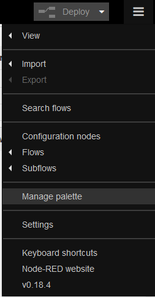
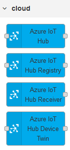

Run a simple JavaScript sample on WiT100X-NodeRED device running Embedded Linux
===
---

# Table of Contents

-   [Introduction](#Introduction)
-   [Step 1: Prerequisites](#Prerequisites)
-   [Step 2: Prepare your Device](#PrepareDevice)
-   [Step 3: Build and Run the Sample](#Build)
-   [Next Steps](#NextSteps)

# Introduction

**About this document**

This document describes how to connect WiT100X-NodeRED device running Embedded Linux with Azure IoT SDK. This multi-step process includes:
-   Configuring Azure IoT Hub
-   Registering your IoT device
-   Build and deploy Azure IoT SDK on device

# Step 1: Prerequisites

You should have the following items ready before beginning the process:

-   [Prepare your development environment][setup-devbox-linux]
-   [Setup your IoT hub][lnk-setup-iot-hub]
-   [Provision your device and get its credentials][lnk-manage-iot-hub]
-   Computer with Git client installed 
-   WiT100X-NodeRED device.

# Step 2: Prepare your Device

-   Connect you PC to the device using the ethernet interface
-   Setup a static IP to your local computer 10.0.50.54
-   Connect to the WiT100X-NodeRED using putty or WebUI
-   Default login-credentials:
    -   Username: admin
    -   Password: default

# Step 3: Build and Run the Sample

## 3.1 Load the Azure IoT bits and prerequisites on device

-   Open a PuTTY session and connect to the device.

-   NodeRED is installed by default, you can simply check the version with

        node --version

-   Download the SDK to the board by issuing the following command in PuTTY:

        git clone --recursive https://github.com/Azure/azure-iot-sdk-node.git

-   Verify that you now have a copy of the source code under the directory `~/azure-iot-sdk-node`.

## 3.2 Build the samples

-   To validate the source code run the following commands on the device.

        export IOTHUB_CONNECTION_STRING='<iothub_connection_string>'

    Replace the `<iothub_connection_string>` placeholder with IoTHub Connection String you got in [Step 1](#Prerequisites).    

-   Run the following commands 

        cd ~/azure-iot-sdk-node
        build/dev-setup.sh
        build/build.sh | tee LogFile.txt

    ***Note:*** *LogFile.txt in above command should be replaced with a file name where build output will be written.*

-   Install npm package to run sample.

        cd ~/azure-iot-sdk-node/device/samples

    **For AMQP Protocol:**
	
        npm install azure-iot-device-amqp
	
    **For HTTP Protocol:**
	
        npm install azure-iot-device-http
	
    **For MQTT Protocol:**

        npm install azure-iot-device-mqtt	

-   To update sample, run the following command on device.

        cd ~/azure-iot-sdk-node/device/samples
        nano simple_sample_device.js

-   This launches a console-based text editor. Scroll down to the
    protocol information.
    
-   Find the below code:

        var Protocol = require('azure-iot-device-amqp').Amqp;
	
    The default protocol used is AMQP. Code for other protocols(HTTP/MQTT) are mentioned just below the above line in the script.
    Uncomment the line as per the protocol you want to use.

-   Scroll down to the connection information.
    Find the following place holder for IoT connection string:

        var connectionString = "[IoT Device Connection String]";

-   Replace the above placeholder with device connection string. You can get this from DeviceExplorer as explained in [Step 1](#Prerequisites), that you copied into Notepad.

-   Save your changes by pressing Ctrl+O and when nano prompts you to save it as the same file, just press ENTER.

-   Press Ctrl+X to exit nano.

-   Run the following command before leaving the **~/azure-iot-sdk-node/device/samples** directory

        npm link azure-iot-device

## 3.3 Run and Validate the Samples

### 3.3.1 Send Device Events to IOT Hub

-   Run the sample by issuing following command and verify that data has been successfully sent and received.

        node ~/azure-iot-sdk-node/device/samples/simple_sample_device.js

-   See [Manage IoT Hub][lnk-manage-iot-hub] to learn how to observe the messages IoT Hub receives from the application.

### 3.3.2 Receive messages from IoT Hub

-   See [Manage IoT Hub][lnk-manage-iot-hub] to learn how to send cloud-to-device messages to the application.

# 4. Choose NodeRED WebUI

-   Login to `10.0.50.100:1880` using your web browser

-   click on **hamburger -> manage palette** an search for **node-red-contrib-azure-iot-hub**
(a list of tested nodes is written down in the manual in chapter 6.3)

 

Click install and wait for the installation to be finished (this might take a few minutes)
After this you will see the azure node on the left side

 

To see how to use the nodes check the following link: <https://flows.nodered.org/node/node-red-contrib-azure-iot-hub>

# Next Steps

You have now learned how to run a sample application that collects sensor data and sends it to your IoT hub. To explore how to store, analyze and visualize the data from this application in Azure using a variety of different services, please click on the following lessons:

-   [Manage cloud device messaging with iothub-explorer]
-   [Save IoT Hub messages to Azure data storage]
-   [Use Power BI to visualize real-time sensor data from Azure IoT Hub]
-   [Use Azure Web Apps to visualize real-time sensor data from Azure IoT Hub]
-   [Weather forecast using the sensor data from your IoT hub in Azure Machine Learning]
-   [Remote monitoring and notifications with Logic Apps]   

[Manage cloud device messaging with iothub-explorer]: https://docs.microsoft.com/en-us/azure/iot-hub/iot-hub-explorer-cloud-device-messaging
[Save IoT Hub messages to Azure data storage]: https://docs.microsoft.com/en-us/azure/iot-hub/iot-hub-store-data-in-azure-table-storage
[Use Power BI to visualize real-time sensor data from Azure IoT Hub]: https://docs.microsoft.com/en-us/azure/iot-hub/iot-hub-live-data-visualization-in-power-bi
[Use Azure Web Apps to visualize real-time sensor data from Azure IoT Hub]: https://docs.microsoft.com/en-us/azure/iot-hub/iot-hub-live-data-visualization-in-web-apps
[Weather forecast using the sensor data from your IoT hub in Azure Machine Learning]: https://docs.microsoft.com/en-us/azure/iot-hub/iot-hub-weather-forecast-machine-learning
[Remote monitoring and notifications with Logic Apps]: https://docs.microsoft.com/en-us/azure/iot-hub/iot-hub-monitoring-notifications-with-azure-logic-apps
[setup-devbox-linux]: https://github.com/Azure/azure-iot-device-ecosystem/blob/master/get_started/node-devbox-setup.md
[lnk-setup-iot-hub]: ../setup_iothub.md
[lnk-manage-iot-hub]: ../manage_iot_hub.md
