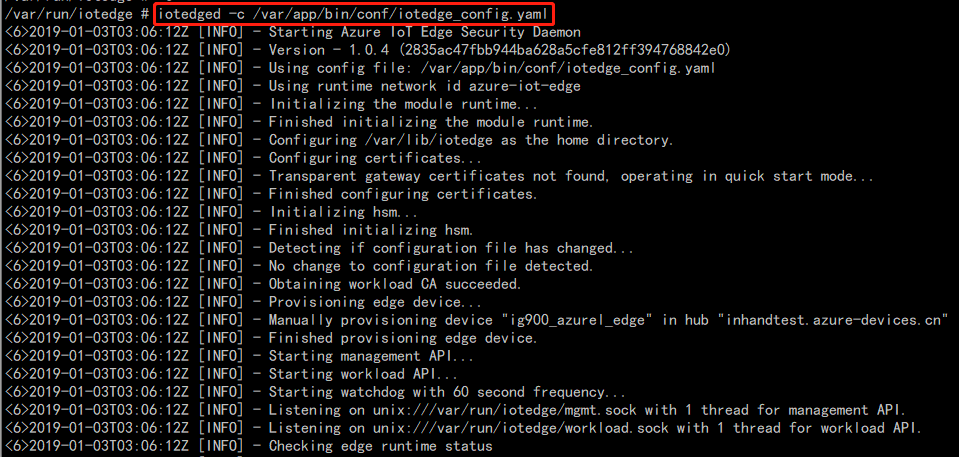
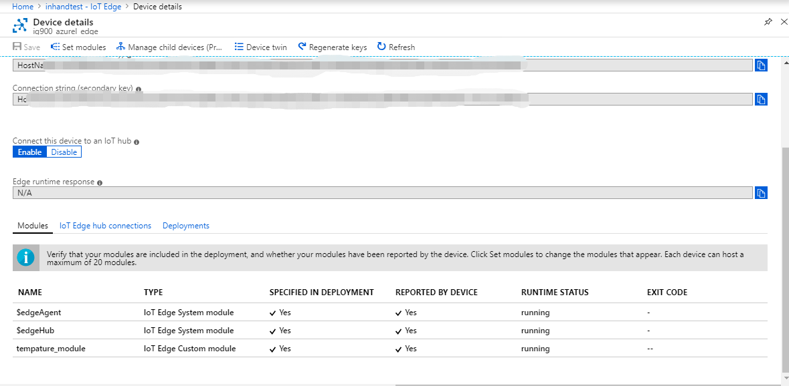
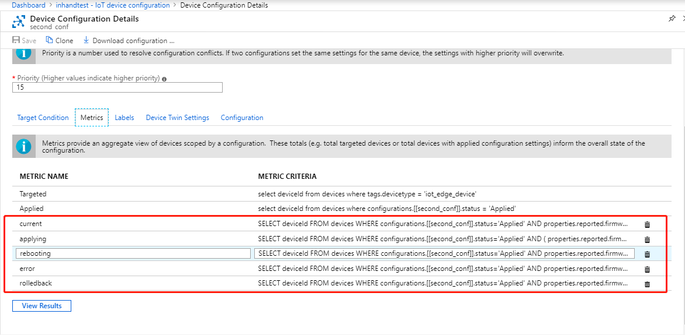
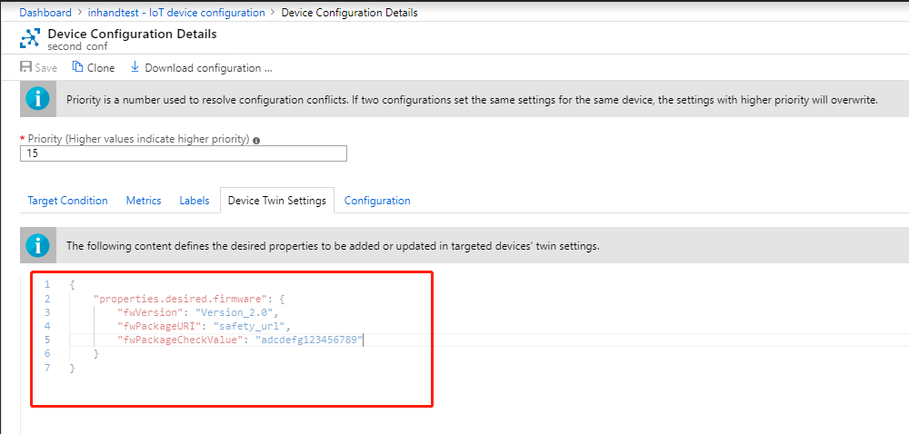
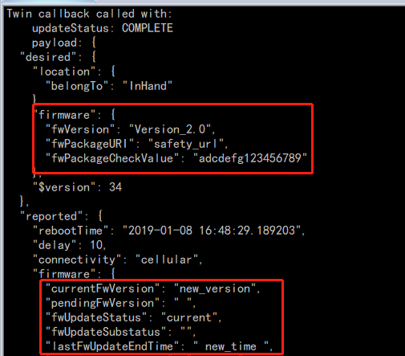
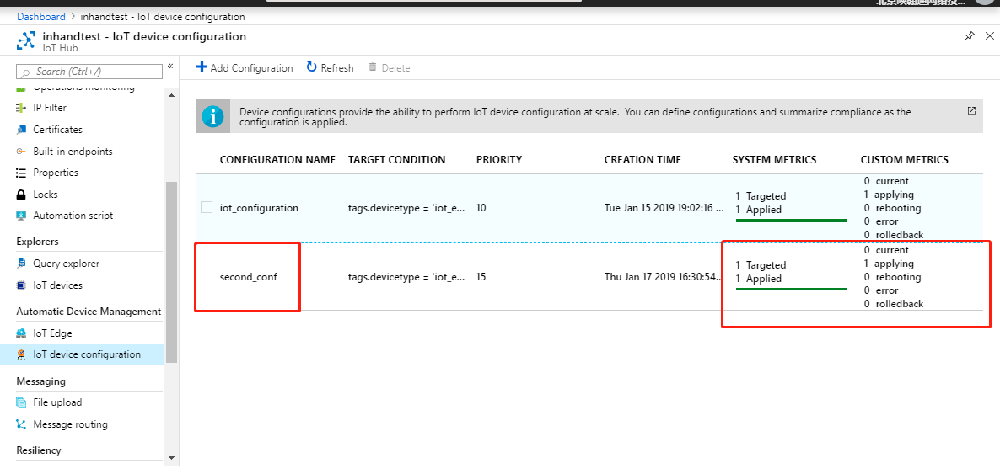
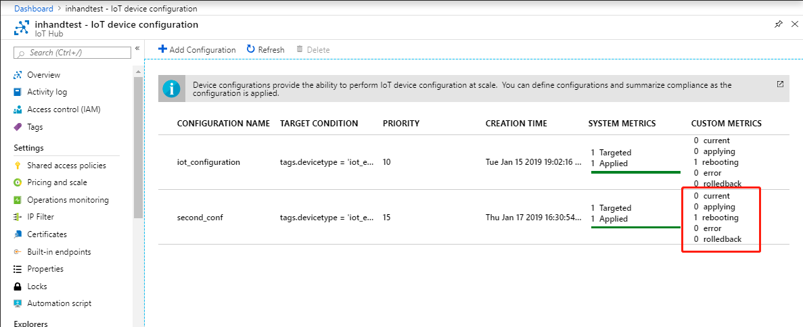

Run a simple Python sample on IG902-H device running Custom Linux
===
---

# Table of Contents

-   [Introduction](#Introduction)
-   [Step 1: Prerequisites](#Prerequisites)
-   [Step 2: Prepare your Device](#PrepareDevice)
-   [Step 3: Manual Test for Azure IoT Edge on device](#Manual)

# Introduction

**About this document**

This document describes how to connect IG902-H device running Custom Linux with Azure IoT Edge Runtime pre-installed and Device Management. This multi-step process includes:

-   Configuring Azure IoT Hub
-   Registering your IoT device
-   Build and Deploy client component to test device management capability 

# Step 1: Prerequisites

You should have the following items ready before beginning the process:

-   [Prepare your development environment][setup-devbox-linux]
-   [Setup your IoT hub](https://account.windowsazure.com/signup?offer=ms-azr-0044p)
-   [Provision your device and get its credentials][lnk-manage-iot-hub]
-   [Sign up to IOT Hub](https://account.windowsazure.com/signup?offer=ms-azr-0044p)
-   [Add the Edge Device](https://docs.microsoft.com/en-us/azure/iot-edge/quickstart-linux)
-   [Add the Edge Modules](https://docs.microsoft.com/en-us/azure/iot-edge/quickstart-linux#deploy-a-module)
-   InGateway IG902-H device.
-   We provide an app called **AzureEdgeManager** to manage both dockerd and iotedged. it is located in **/var/app/**

# Step 2: Prepare your Device

-  the URL for the device is [https://www.inhand.com.cn/products/edge-computing-gateway.html](https://www.inhand.com.cn/products/edge-computing-gateway.html)
-  Connect the InGateway IG902-B using ssh or telnet with putty.

# Step 3: Manual Test for Azure IoT Edge on device

This section walks you through the test to be performed on the Edge devices running the Linux operating system such that it can qualify for Azure IoT Edge certification.

## 3.1 Edge RuntimeEnabled (Mandatory)

**Details of the requirement:**

The following components come pre-installed or at the point of distribution on the device to customer(s):

-   Azure IoT Edge Security Daemon
-   Daemon configuration file
-   Moby container management system
-   A version of `hsmlib` 

*Edge Runtime Enabled:*

**Check the iotedge daemon command:** 

Open the command prompt on your IoT Edge device , run Azure IoT edge Daemon.

    iotedged -c PATH_TO_IOTEDGE_CONFIG_FILE

 

Open the command prompt on your IoT Edge device, confirm that the module deployed from the cloud is running on your IoT Edge device

    iotedge list

 

On the device details page of the Azure, you should see the runtime modules - edgeAgent, edgeHub and tempSensor modueles are under running status

 

## 3.2 Device Management (Mandatory)

**Pre-requisites:** Device Connectivity.

**Description:** A device that can perform basic device management operations (Reboot and Firmware update) triggered by messages from IoT Hub.

## 3.2.1 Firmware Update (Using Microsoft SDK Samples):

Specify the path {/var/app/}} where the firmwareupdate client components are installed.

To run the simulated device application, open a shell or command prompt window and navigate to the *SimulatedDevice.py** folder . Then run the following commands:

    python SimulatedDevice.py 
 
Since it seems *Microsoft Python SDK API* doesn't support to add new configuration including **metrics**  , we add the configuration with **Azure Portal**
At first,  Create a configuration as following:

**Note:** You need to add certification in client side [iothub\_client\_cert.py](https://github.com/Azure/azure-iot-sdk-python/blob/master/device/samples/iothub_client_cert.py)

*Azure Portal* [refer link](https://docs.microsoft.com/en-us/azure/iot-hub/iot-hub-auto-device-config)
 
When you save this config it will trigger  a device twin callback function on the device side, and we can use **SimulatedDevice.py** to simulate firmwareUpdate and to report different status.

*python SimulatedDevice.py logs*:

You can also see the different status on Azure portal:

## 3.2.2  Reboot (Using Microsoft SDK Samples):
Specify the path **/var/app/** where the components are installed 

1. At the command prompt, run the following command to begin listening for the reboot direct method.

	    python dmpatterns_getstarted_device.py

2. At another command prompt, run the following command to trigger the remote reboot and query for the device twin to find the last reboot time.

	    python dmpatterns_getstarted_service.py 

python dmpatterns_getstarted_device.py  logs:

python dmpatterns_getstarted_service.py logs:

  
[setup-devbox-linux]: https://github.com/Azure/azure-iot-sdk-c/blob/master/doc/devbox_setup.md
[lnk-setup-iot-hub]: ../setup_iothub.md
[lnk-manage-iot-hub]: ../manage_iot_hub.md