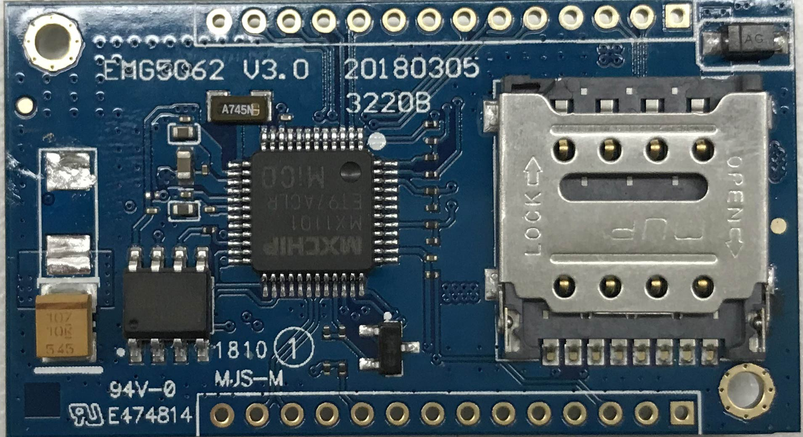
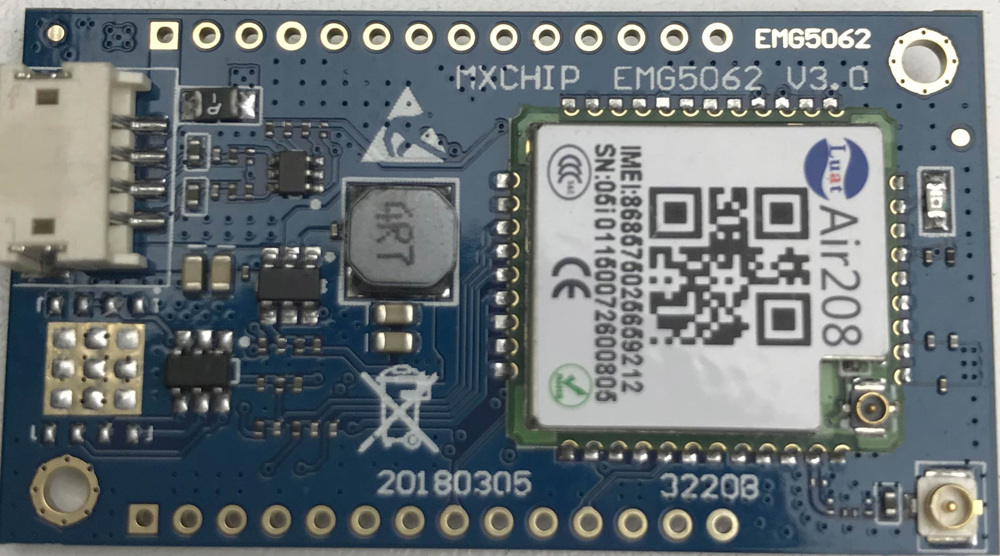
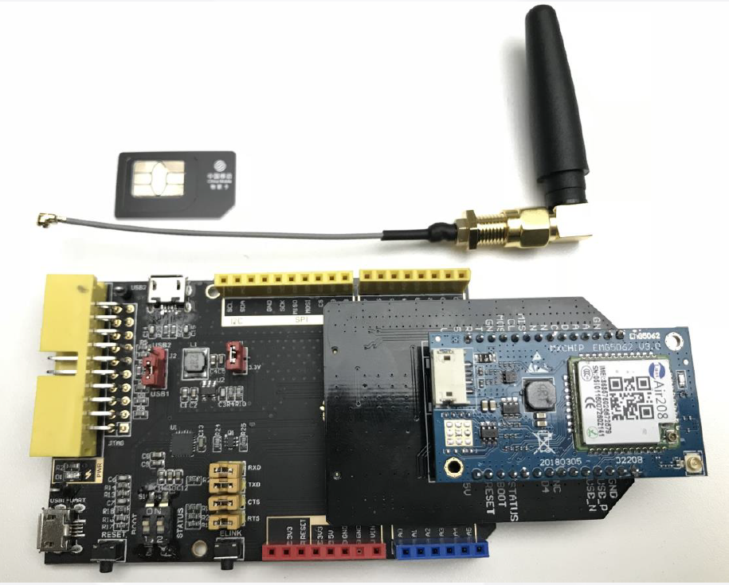
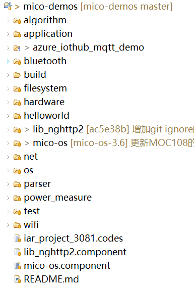
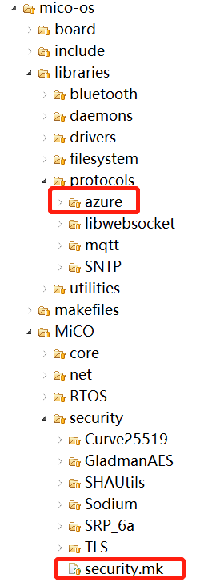
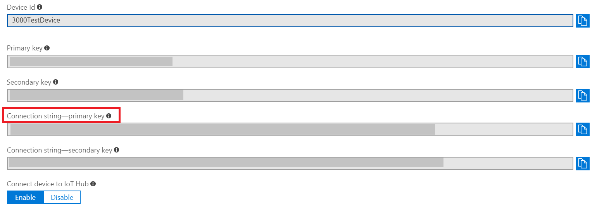

Run a simple C sample on supported MiCOKit device running MiCO
===
---

# Table of Contents

-   [Introduction](#Introduction)
-   [Step 1: Prerequisites](#Prerequisites)
-   [Step 2: Prepare your Device](#PrepareDevice)
-   [Step 3: Build and Run the Sample](#Build)

# Introduction

**About this document**

This document describes how to connect supported MiCOKit device running MiCO with Azure IoT SDK. This multi-step process includes:

-   Configuring Azure IoT Hub
-   Registering your IoT device
-   Build and deploy Azure IoT SDK using [Azure-SDK-C-MiCO](https://github.com/Neo117/Azure_SDK_C_MiCO) on supported device
-   Validate the sample using Serial-debug-tool and Device-Explorer-Twin

**About the MiCOKit**

MiCOKit board is ShangHai MXCHIP's development kits for developers and engineers to fast connect the IoT internet.
Static state show:

-   MXCHIP's WiFi module picture

-   MXCHIP's development kits picture

# Step 1: Prerequisites

Before executing any of the steps below, please read each process step by step to ensure end to end understanding.

You should have the following items ready before beginning the process:

-   Computer with GitHub installed and access to
   [Azure-SDK-C-MiCO](https://github.com/Neo117/Azure_SDK_C_MiCO) GitHub public repository.
-   Required hardware:
	-   Prepare [mxchip wifi module board](http://www.mxchip.com/product/wifi),for example MiCOKit3080.Please submit Sample application information on [mxchip.com](http://bbs.mxchip.com/),if you don't have a mxchip wifi module board.
	-   Download and install [MiCoder IDE](http://developer.mxchip.com/downloads/2)
	-   USB Mini cable
	-   J-link v8/v9

***Note:*** *If you haven't contacted Microsoft about being an Azure Certified for IoT partner, please submit this [form](https://catalog.azureiotsuite.com/) first to request it and then follow these instructions.*

# Step 2: Prepare your Device

-   Install the latest MiCoderIDE software on your computer by
following the instructions in the [MiCoder IDE v1.2](http://developer.mxchip.com/downloads/2).
-   MiCo cube coule be used to obtain MiCO demo SDK. Please follow the instruction from [here](http://developer.mxchip.com/developer/md/bWljby1oYW5kYm9vay8yLk1pQ09fdG9vbHMvc2VjX2xpbmtfcGFnZS9NaUNPX0N1YmVfRW5nbGlzaC5tZA). Input command `mico import mico-demos` in mico-cube.
-   After download MiCO demo SDK. Open MiCoder IDE, select the menu bar: `File - >Import`, select: `General - >Existing Projects into Workspace`, then `Next`, click `Browse`, select the local MiCO project path, click `Finish`.

  

-   Add file "azure\_iothub\_mqtt\_demo" into mico-demos. Copy other files  from Azure\_SDK\_C\_MiCO to mico-os file.

  

-   [Regist azure.microsoft account](https://azure.microsoft.com/zh-cn/free/) to get free account for iothub.
-   Add iothub service in azure cloud control center.
-   Install [Azure tool(Azure CLI)](https://docs.microsoft.com/zh-cn/azure/iot-hub/iot-hub-raspberry-pi-kit-node-lesson2-get-azure-tools-win32) on your computer.
-   Click here to download and install DeviceExplorer，you will register your device using DeviceExplorer. Fllowing [here](https://github.com/Azure/azure-iot-device-ecosystem/blob/master/iotcertification/iot_certification_port_c_libraries_other_platforms/iot_certification_port_c_libraries_other_platforms.md) to study how to regist your device.
-   When you have regested your device, you can get DEVICE ID and connect string-primary key in your devices list. Copy the connect string-primary key and pasted on "\mqtt\azure_iothub_mqtt_demo\azure_config.h":

    `static const char* connectionString = "xxx"`

  

# Step 3: Build SDK and Run the sample

-   In micoderIDE, using "azure\_iothub\_mqtt\_gprs\_demo@MK3080B@moc total download run" command to compile and download to the board.
-   In this section you will run the Azure IoT client SDK samples and DeviceExplorer to validate communication between your device and Azure IoT Hub. You will send messages to the Azure IoT Hub service and validate that IoT Hub has successfully receive the data.

# Next Step

You have now learned how to run a sample application that collects sensor data and sends it to your IoT hub. To explore how to store, analyze and visualize the data from this application in Azure using a variety of different services, please click on the following lessons:

-   [Manage cloud device messaging with iothub-explorer](https://docs.microsoft.com/en-us/azure/iot-hub/iot-hub-explorer-cloud-device-messaging)
-   [Save IoT Hub messages to Azure data storage](https://docs.microsoft.com/en-us/azure/iot-hub/iot-hub-store-data-in-azure-table-storage)
-   [Use Power BI to visualize real-time sensor data from Azure IoT Hub](https://docs.microsoft.com/en-us/azure/iot-hub/iot-hub-live-data-visualization-in-power-bi)
-   [Use Azure Web Apps to visualize real-time sensor data from Azure IoT Hub](https://docs.microsoft.com/en-us/azure/iot-hub/iot-hub-live-data-visualization-in-web-apps)
-   [Weather forecast using the sensor data from your IoT hub in Azure Machine Learning](https://docs.microsoft.com/en-us/azure/iot-hub/iot-hub-weather-forecast-machine-learning)
-   [Remote monitoring and notifications with Logic Apps](https://docs.microsoft.com/en-us/azure/iot-hub/iot-hub-monitoring-notifications-with-azure-logic-apps)
