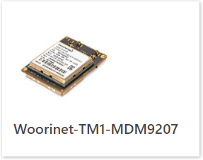
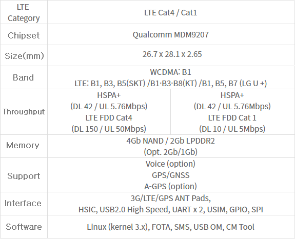

Run a C sample on TM1
===
---

# Table of Contents

-   [Introduction](#Introduction)
-   [Step 1: Prerequisites](#Prerequisites)
-   [Step 2: Setup Woori-net SDK](#SetupSDK)
-   [Step 3: Build and Run the Sample](#Build)
-   [Next Steps](#NextSteps)

# Introduction

**About this document**

This document describes how to build and run Woori-net SDK with Azure on MDM9207 module.
-   Setup woori-net SDK with Azure
-   Build the sample code
-   Download and Run sample application

**About the TM1**

Woori-net TM1 series is Qualcomm chipset(MDM9207) based module.

-   Module picture

   
  
- Module feature

   

# Step 1: Prerequisites

You should have the following items ready before beginning the process:

-   Computer with Ubuntu Linux(14.04.5 or later) 
-   TM1 module with Development kit.

# Step 2: Setup Woori-Net SDK with Azure

Before Setup Woori-Net SDK, Check free disk space in your computer, It needs over 1 GB

    C
    df -h

**Ubuntu terminal**

    c
    sudo apt-get install git cmake build-essential python
    git clone https://gitlab.com/wooriNet/sdkle.git
    cd sdkle
    chmod 755 sdk_install.sh relocate_sdk.py
    sudo ./sdk_install.sh

# Step 3: Build Sample and Run

There are many azure sample code in azure sdk. we will build one of these sample code as an example. And will use CMAKE for cross platform make tool.

    C
    git clone https://github.com/Azure/azure-iot-sdk-c.git 
    mkdir azure_app 
    cd azure_app
    cp ../azure-iot-sdk-c/iothub_client/samples/iothub_ll_telemetry_sample/iothub_ll_telemetry_sample.c .
    cp -r ../azure-iot-sdk-c/certs .
    vi iothub_ll_telemetry_sample.c

Edit **connectionString** variable to your IoTHub Device connection string.

**sample:** 

    C 
    static const char* connectionString = "HostName=gpsCenter.azure-devices.net;DeviceId=myNewDevice;SharedAccessKey=s9njI+NDKnpWhAGib6Ro1PvUX/O0X3jU1+hFMkTunek=";

Create 'CMakeLists.txt' file.

    C
    vi CMakeLists.txt

**sample:**

    C
    INCLUDE(CMakeForceCompiler)

    SET(CMAKE_SYSTEM_NAME Linux)
    SET(CMAKE_SYSTEM_VERSION 1)
    SET(CMAKE_SYSTEM_PROCESSOR arm)

    PROJECT(hello)
    cmake_minimum_required(VERSION 2.8.0)

    #Below '/home/wnapp/sdkle' should be changed to you woori-net sdk install path.
    SET(SC_ROOT /home/wnapp/sdkle/sysroots/armv7a-vfp-neon-oe-linux-gnueabi)
    SET(SC_GNUEABI /home/wnapp/sdkle/sysroots/x86_64-oesdk-linux/usr/bin/arm-oe-linux-gnueabi)

    SET(CMAKE_C_COMPILER ${SC_GNUEABI}/arm-oe-linux-gnueabi-gcc)

    SET(CMAKE_C_FLAGS "${CMAKE_C_FLAGS} --sysroot=${SC_ROOT} -std=c99" CACHE INTERNAL "" FORCE)
    SET(CMAKE_C_LINK_FLAGS "${CMAKE_C_LINK_FLAGS} --sysroot=${SC_ROOT}" CACHE INTERNAL "" FORCE)

    INCLUDE_DIRECTORIES(${SC_ROOT}/usr/include/Azure)
    INCLUDE_DIRECTORIES(${SC_ROOT}/usr/include/Azure/inc)

    LINK_LIBRARIES(serializer)
    LINK_LIBRARIES(iothub_client)
    LINK_LIBRARIES(iothub_client_amqp_transport)
    LINK_LIBRARIES(uamqp)
    LINK_LIBRARIES(iothub_client_http_transport)
    LINK_LIBRARIES(iothub_client_mqtt_transport)
    LINK_LIBRARIES(umqtt)
    LINK_LIBRARIES(aziotsharedutil)
    LINK_LIBRARIES(parson)
    LINK_LIBRARIES(pthread)
    LINK_LIBRARIES(curl)
    LINK_LIBRARIES(ssl)
    LINK_LIBRARIES(crypto)
    LINK_LIBRARIES(m)

    add_definitions(-DSET_TRUSTED_CERT_IN_SAMPLES)
    add_definitions(-DSAMPLE_MQTT)
    INCLUDE_DIRECTORIES(certs)

    set (iothub_ll_telemetry_sample.c 
                    certs/certs.c)

    add_executable(testApp ${source_files})

    SET(CMAKE_VERBOSE_MAKEFILE TRUE)
    SET(CMAKE_FIND_ROOT_PATH_MODE_PROGRAM NEVER)
    SET(CMAKE_FIND_ROOT_PATH_MODE_LIBRARY ONLY)
    SET(CMAKE_FIND_ROOT_PATH_MODE_INCLUDE ONLY)

**Build files.**

    C cmake . make

Copy execute file into the TM1 module.

Make sure your TM1 device is connected to the Computer.

    sudo adb server-start
    adb push testApp /usr/bin

Run azure application

    adb shell
    cd /usr/bin/
    ./testApp

# Next Steps

You have now learned how to run a sample application that collects sensor data and sends it to your IoT hub. To explore how to store, analyze and visualize the data from this application in Azure using a variety of different services, please click on the following lessons:

-   [Manage cloud device messaging with iothub-explorer]
-   [Save IoT Hub messages to Azure data storage]
-   [Use Power BI to visualize real-time sensor data from Azure IoT Hub]
-   [Use Azure Web Apps to visualize real-time sensor data from Azure IoT Hub]
-   [Weather forecast using the sensor data from your IoT hub in Azure Machine Learning]
-   [Remote monitoring and notifications with Logic Apps]   

[Manage cloud device messaging with iothub-explorer]: https://docs.microsoft.com/en-us/azure/iot-hub/iot-hub-explorer-cloud-device-messaging
[Save IoT Hub messages to Azure data storage]: https://docs.microsoft.com/en-us/azure/iot-hub/iot-hub-store-data-in-azure-table-storage
[Use Power BI to visualize real-time sensor data from Azure IoT Hub]: https://docs.microsoft.com/en-us/azure/iot-hub/iot-hub-live-data-visualization-in-power-bi
[Use Azure Web Apps to visualize real-time sensor data from Azure IoT Hub]: https://docs.microsoft.com/en-us/azure/iot-hub/iot-hub-live-data-visualization-in-web-apps
[Weather forecast using the sensor data from your IoT hub in Azure Machine Learning]: https://docs.microsoft.com/en-us/azure/iot-hub/iot-hub-weather-forecast-machine-learning
[Remote monitoring and notifications with Logic Apps]: https://docs.microsoft.com/en-us/azure/iot-hub/iot-hub-monitoring-notifications-with-azure-logic-apps
[setup-devbox-windows]: https://github.com/Azure/azure-iot-sdk-c/blob/master/doc/devbox_setup.md
[lnk-setup-iot-hub]: ../setup_iothub.md
[lnk-manage-iot-hub]: ../manage_iot_hub.md