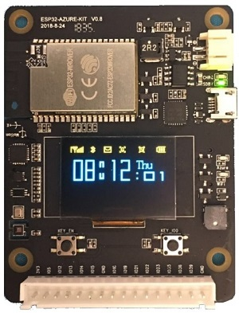
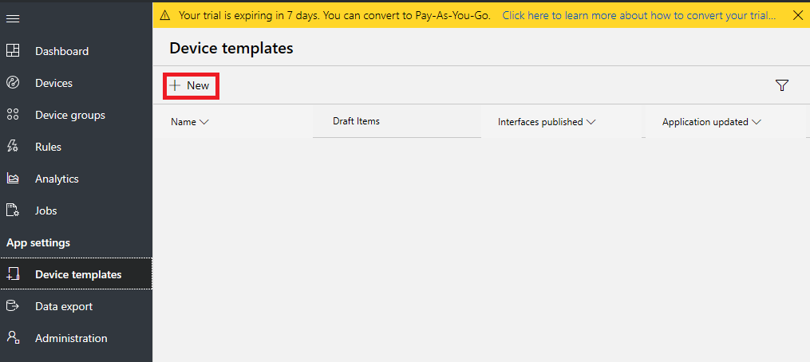
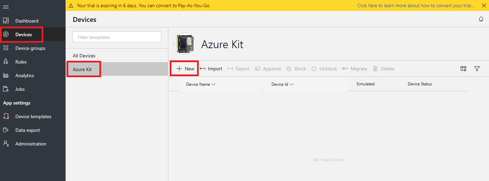
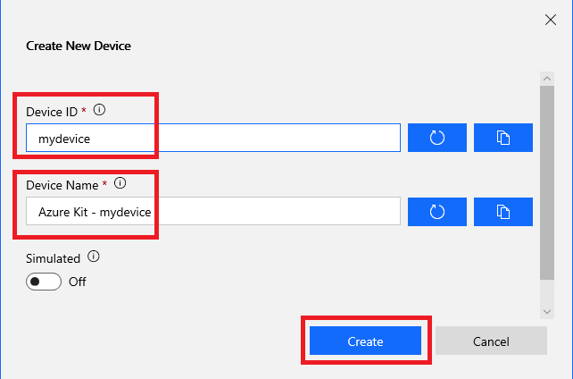
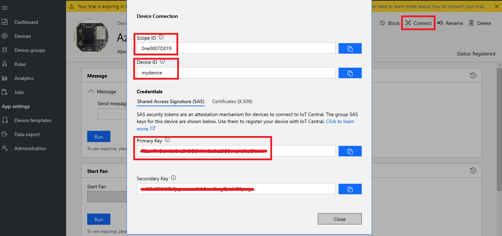
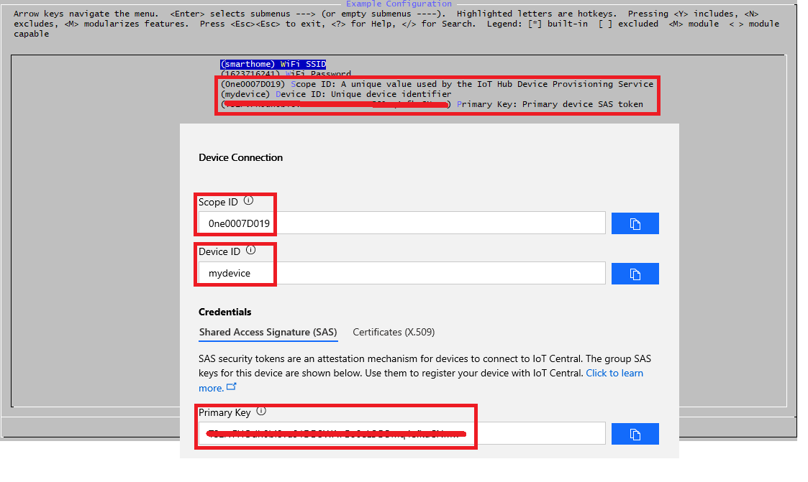
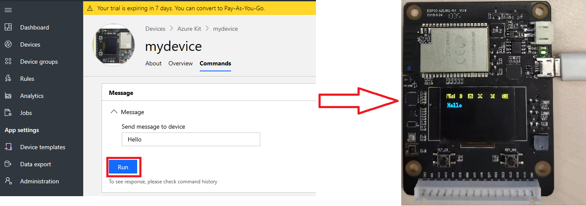

# Implement Azure IoT PnP on esp32-azure-kit based on Azure IoT C public preview SDK.

In this tutorial, you will learn how to use the esp32-azure-kit board to send data to Azure IoT Central with Azure IoT plug and play.

## Features implemented

-   Azure IoT plug and play
-   Register device by IoT Hub Device Provisioning Service base on an X.509 digital certificate
-   Telemetry data sent for all onboard sensors
-   Display temperature and humidity on screen
-   Cloud to device messages (supports sending a message to display on the screen, press button to go back humiture screen)

## What you need

-   An esp32-azure-board kit

    

-   An active Azure subscription. If you do not have one, you can register via one of these two methods:
    -   Activate a [free 30-day trial Microsoft Azure account](https://azure.microsoft.com/free/).
    -   Claim your [Azure credit](https://azure.microsoft.com/pricing/member-offers/msdn-benefits-details/) if you are MSDN or Visual Studio subscriber.

-   ESP-IDF (Espressif IoT Development Framework)
    -   Please refer the [ESP-IDF Programming Guide](https://docs.espressif.com/projects/esp-idf/en/stable/) to set up the ESP32 development environment.

## How to start
### Prepare the development enviroment
  -   Setup the ESP-IDF development environment by following this guide <https://docs.espressif.com/projects/esp-idf/en/stable/get-started/>
  -   Clone the code to your local computer with the command: 
  
          git clone --recursive -b public-preview-symmetric-key https://github.com/espressif/esp-azure.git

### Create Azure IoT Central application

  1.  Use your Azure account log into [Azure IoT Central](https://apps.azureiotcentral.com).
  2.  Create a **free preview applicaton**.

      

  3.  Select **Device templates** and then click **+ New** to create device template.

      

  4.  Choose the pre-certified device (ESP32-Azure Kit) to create Device template.

      
  5.  Go to the **Devices** page select **Azure Kit** and click **+ New** to create a new device.

      

  6.  In the popup device info page, set **Device ID**, **Device Name** and then click **Create** button to create a new device.

      

  7.  In the **Devices** page, click the device you created in step 6 to enter device detail info page.

      

  8.  Click **Connect** button to get **Scope ID**, **Device ID**, **Primary Key**, and make a note of them.

      

### Build and flash the code
  1.  `cd` to the directory **esp-azure-pnp/examples/azure_iot_pnp_sample**.
  2.  Run `make menuconfig`, and update the values under **Example Configuration** section with the infomation you noted in previous step.
      -   **Scope ID:** A unique value used by the IoT Hub Device Provisioning Service. 
      -   **Device ID:** Unique device identifier.
      -   **Primary Key:** Primary device SAS token.

      

  3.  Run `make flash` to flash the app to esp32-azure-kit and wait for the device to reboot.

### View the device in IoT central
  1.  In your IoT Central application, go to the **Devices** page and select the device you created in previous step. The device will be automatically registered when the device boots up.

      
    After a couple of minutes, this page will show the telemetry data.

  2.  Select the **About** page to see the property values the device sent.
  3.  Select the **Commands** page to call commands on the device.

      

## Note:
  1.  For details about Azure IoT PnP project, please refer to: https://github.com/Azure/azure-iot-sdk-c-pnp/tree/public-preview
  2.  If the device can't send telemetry data to IoT central, run the command **make monitor** to check the device logs
