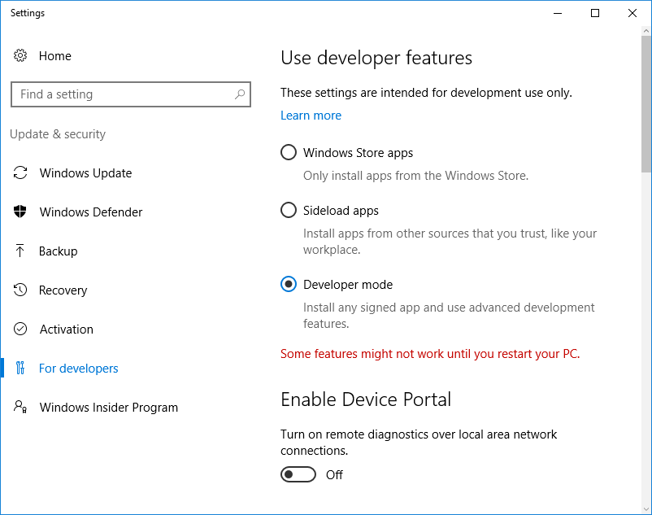

Run a simple Csharp sample on a Softing IISK GL20 device.
===
---

For further device descriptions regarding the device see: [Industrial IoT Starter Kit](https://data-intelligence.softing.com/products/iot-gateways/industrial-iot-starter-kit/)

# Table of Contents

-   [Introduction](#Introduction)
-   [Step: Prerequisites](#Prerequisites)
-   [Step: Build and Run the Sample](#Build)
-   [Next Steps](#NextSteps)

# Introduction

**About this document**

This document describes how to connect a Softing IISK GL20 device with Azure IoT SDK. This multi-step process includes:
-   Configuring the  Azure IoT Hub
-   Registering the IoT device
-   Build and deploy Azure IoT SDK on device

**Note:** The Softing IISK GL20 is a Hewlett Packard Enterprise GL20 IoT Gateway device, with additional software pre-installed. So this getting started is nearly the same as [hpe-azure-certified-windows-operating-systems-gl20-csharp](hpe-azure-certified-windows-operating-systems-gl20-csharp.md). Especially the following software is installed:

-   Microsoft Windows 10 IoT Enterprise LTSB 1607
-   Softing dataFEED suite
-   Docker Community Edition (Installer)

So for the end user, it might be more beneficial to use the docker containers of [Azure/iot-edge-opc-proxy](https://github.com/Azure/iot-edge-opc-proxy) and [Azure/iot-edge-opc-publisher](https://github.com/Azure/iot-edge-opc-publisher) to connect OPC UA endpoints with the Azure IoT-hub. A more detailed description is available within the manual in the [download section](https://data-intelligence.softing.com/products/iot-gateways/industrial-iot-starter-kit/#tx-dftabs-tabContent2).

# Step: Prerequisites

Have the following items ready before beginning the process:

-   [Setup the IoT hub][lnk-setup-iot-hub]
-   [Provision the device and get its credentials][lnk-manage-iot-hub]
-   Softing IISK GL20 device.
-   Connection to internet, outgoing traffic not blocked by firewall.

# Step: Build and Run the sample

-   Download the [Azure IoT SDK](https://github.com/Azure/azure-iot-sdk-csharp) and the sample programs and save them to a local repository.
-   Start a new instance of Visual Studio 2017.
-   Open the **iothub\_csharp\_client.sln** solution in the `device` folder in the local copy of the repository.
-   Enable developer mode in Windows 10 settings:

    

-   In Visual Studio, from Solution Explorer, navigate to the **samples** folder.
-   In the **DeviceClientAmqpSample** project, open the ***Program.cs*** file.
-   Locate the following code in the file:

        private const string DeviceConnectionString = "<replace>";
        
-   Replace `<replace>` with the connection string for the device.
-   In **Solution Explorer**, right-click the **DeviceClientAmqpSample** project, click **Debug**, and then click **Start new instance** to build and run the sample. The console displays messages as the application sends device-to-cloud messages to IoT Hub.
-   Use the **DeviceExplorer** utility to observe the messages IoT Hub receives from the **Device Client AMQP Sample** application.
-   Refer "Monitor device-to-cloud events" in [DeviceExplorer Usage document](https://github.com/Azure/azure-iot-sdk-csharp/blob/master/tools/DeviceExplorer/doc/how_to_use_device_explorer.md) to see the data the device is sending.
-   Refer "Send cloud-to-device messages" in [DeviceExplorer Usage document](https://github.com/Azure/azure-iot-sdk-csharp/blob/master/tools/DeviceExplorer/doc/how_to_use_device_explorer.md) for instructions on sending messages to device.

# Next Steps

You have now learned how to run a sample application that collects sensor data and sends it to your IoT hub. To explore how to store, analyze and visualize the data from this application in Azure using a variety of different services, please click on the following lessons:

-   [Manage cloud device messaging with iothub-explorer]
-   [Save IoT Hub messages to Azure data storage]
-   [Use Power BI to visualize real-time sensor data from Azure IoT Hub]
-   [Use Azure Web Apps to visualize real-time sensor data from Azure IoT Hub]
-   [Weather forecast using the sensor data from an IoT hub in Azure Machine Learning]
-   [Remote monitoring and notifications with Logic Apps]   

[Manage cloud device messaging with iothub-explorer]: https://docs.microsoft.com/en-us/azure/iot-hub/iot-hub-explorer-cloud-device-messaging
[Save IoT Hub messages to Azure data storage]: https://docs.microsoft.com/en-us/azure/iot-hub/iot-hub-store-data-in-azure-table-storage
[Use Power BI to visualize real-time sensor data from Azure IoT Hub]: https://docs.microsoft.com/en-us/azure/iot-hub/iot-hub-live-data-visualization-in-power-bi
[Use Azure Web Apps to visualize real-time sensor data from Azure IoT Hub]: https://docs.microsoft.com/en-us/azure/iot-hub/iot-hub-live-data-visualization-in-web-apps
[Weather forecast using the sensor data from an IoT hub in Azure Machine Learning]: https://docs.microsoft.com/en-us/azure/iot-hub/iot-hub-weather-forecast-machine-learning
[Remote monitoring and notifications with Logic Apps]: https://docs.microsoft.com/en-us/azure/iot-hub/iot-hub-monitoring-notifications-with-azure-logic-apps
[setup-devbox-windows]: https://github.com/Azure/azure-iot-sdk-c/blob/master/doc/devbox_setup.md
[lnk-setup-iot-hub]: ../setup_iothub.md
[lnk-manage-iot-hub]: ../manage_iot_hub.md

