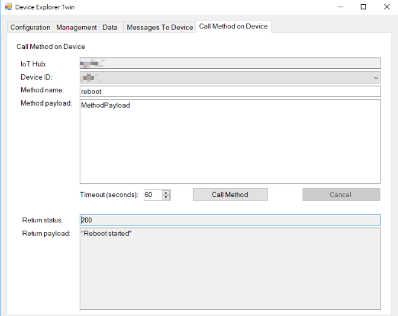

Run a simple JavaScript sample on ESRP-CSS-UNO1372 device running Ubuntu 16.04
===
---

# Table of Contents

-   [Introduction](#Introduction)
-   [Step 1: Prerequisites](#Prerequisites)
-   [Step 2: Prepare your Device](#PrepareDevice)
-   [Step 3: Manual Test for Azure IoT Edge on device](#Manual)

<a name="Introduction"></a>
# Introduction

**About this document**

This document describes how to connect **Advantech ESRP-CSS-UNO1372 Series** device running Ubuntu 16.04 with Azure IoT Edge Runtime pre-installed and Device Management. This multi-step process includes:

-   Configuring Azure IoT Hub
-   Registering your IoT device
-   Build and Deploy client component to test device management capability 

<a name="Prerequisites"></a>
# Step 1: Prerequisites

You should have the following items ready before beginning the process:

-   [Prepare your development environment][setup-devbox-linux]
-   [Setup your IoT hub](https://account.windowsazure.com/signup?offer=ms-azr-0044p)
-   [Provision your device and get its credentials][lnk-manage-iot-hub]
-   [Sign up to IOT Hub](https://account.windowsazure.com/signup?offer=ms-azr-0044p)
-   [Add the Edge Device](https://docs.microsoft.com/en-us/azure/iot-edge/quickstart-linux)
-   [Add the Edge Modules](https://docs.microsoft.com/en-us/azure/iot-edge/quickstart-linux#deploy-a-module)
-   [Advantech ESRP-CSS-UNO1372 device](http://www.advantech.tw/products/gf-bvl2/uno-1372g/mod_8e63b3c9-b606-4725-a1af-94fccb98bb1a)

<a name="PrepareDevice"></a>
# Step 2: Prepare your Device

-   Install Ubuntu on your device, [device website](http://www.advantech.tw/products/gf-bvl2/uno-1372g/mod_8e63b3c9-b606-4725-a1af-94fccb98bb1a).

<a name="Manual"></a>
# Step 3: Manual Test for Azure IoT Edge on device

This section walks you through the test to be performed on the Edge devices running the Linux operating system such that it can qualify for Azure IoT Edge certification.

<a name="Step-3-1-IoTEdgeRunTime"></a>
## 3.1 Edge RuntimeEnabled (Mandatory)

**Details of the requirement:**

The following components come pre-installed or at the point of distribution on the device to customer(s):

-   Azure IoT Edge Security Daemon
-   Daemon configuration file
-   Moby container management system
-   A version of `hsmlib` 

*Edge Runtime Enabled:*

**Check the iotedge daemon command:** 

Open the command prompt on your IoT Edge device , confirm that the Azure IoT edge Daemon is under running state

    systemctl status iotedge

 

Open the command prompt on your IoT Edge device, confirm that the module deployed from the cloud is running on your IoT Edge device

    sudo iotedge list

  

On the device details page of the Azure, you should see the runtime modules - edgeAgent, edgeHub and tempSensor modueles are under running status

 

<a name="Step-3-2-DeviceManagement"></a>
## 3.2 Device Management (Mandatory)

**Pre-requisites:** Device Connectivity.

**Description:** A device that can perform basic device management operations (Reboot and Firmware update) triggered by messages from IoT Hub.

## 3.2.1 Firmware Update (Using Microsoft SDK Samples):

Specify the path ``` ~/FirmwareUpdate ``` where the firmwareupdate client components are installed.

To run the simulated device application, open a shell or command prompt window and navigate to the **iot-hub/Tutorials/FirmwareUpdate** folder in the Node.js project you downloaded. Then run the following commands:

    npm install
    node SimulatedDevice.js "{your device connection string}"

To run the back-end application, open another shell or command prompt window. Then navigate to the **iot-hub/Tutorials/FirmwareUpdate** folder in the Node.js project you downloaded. Then run the following commands:

    npm install
    node ServiceClient.js "{your service connection string}"

IoT device client will get the message and report the status to the device twin.

 


## 3.2.2 Reboot (Using Microsoft SDK Samples):

Specify the path ``` ~/FirmwareUpdate ``` where the components are installed 

Confirm the IoT hub, Device ID, method name as below:

-   Press “call Method” button
-   Check the returning status as below:

 


IoT device client will get the message and report the status to the device twin.

 
  
## 3.3.3 Firmware Update (Modified SDK samples/Custom made application):

Specify the path ``` ~/azure_iot_sample ``` where the firmwareupdate client components are installed.

To run the devicemgr application, open a shell or command prompt window and navigate to the **~/azure_iot_sample/manageddevice** folder. Then run the following commands:

    npm install
    node devicemgr.js "{your device connection string}"

To run the back-end application, open another shell or command prompt window. Then navigate to the **~/azure_iot_sample/serviceclient** folder. Then run the following commands:

    npm install
    node firmwareupdateclient.js "{your service connection string}"

IoT devicemgr will report below status status.

 

## 3.3.4 Reboot (Modified SDK samples/Custom made application): 

Specify the path ``` ~/azure_iot_sample/manageddevice ``` where the components are installed

Then run the following commands:

    npm install
    node rebootService.js "{your device connection string}"

Confirm the IoT hub, Device ID, method name as below:

-   Press “call Method” button
-   Check the returning status as below:

 


IoT device client will get the message and report the status to the device twin.

 

  
[setup-devbox-linux]: https://github.com/Azure/azure-iot-sdk-c/blob/master/doc/devbox_setup.md
[lnk-setup-iot-hub]: ../setup_iothub.md
[lnk-manage-iot-hub]: ../manage_iot_hub.md
