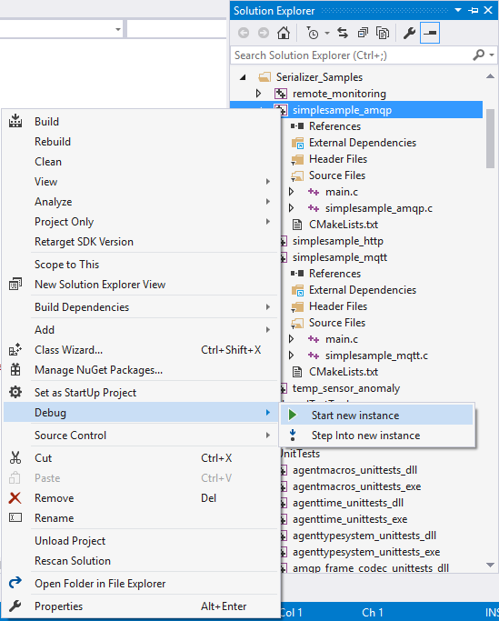

Run a simple C sample on Windows
===
---

# Table of Contents

-   [Introduction](#Introduction)
-   [Step 1: Prerequisites](#Step-1-Prerequisites)
-   [Step 2: Build and Run the Sample](#Step-2-Build)
-   [Next Steps](#NextSteps)

<a name="Introduction"></a>
# Introduction

**About this document**

This document describes how to build and run sample applications on the Windows platform. This multi-step process includes:
-   Configuring Azure IoT Hub
-   Registering your IoT device
-   Build and deploy Azure IoT SDK on device

<a name="Step-1-Prerequisites"></a>
# Step 1: Prerequisites

You should have the following items ready before beginning the process:

-   [Prepare your development environment][devbox-setup]
-   Computer with Git client installed and access to the
    [azure-iot-sdk-c](https://github.com/Azure/azure-iot-sdk-c) GitHub public repository.
-   [Setup your IoT hub][lnk-setup-iot-hub]
-   [Provision your device and get its credentials][lnk-manage-iot-hub]

<a name="Step-2-Build"></a>
# Step 2: Build and Run the sample

1.  Start a new instance of Visual Studio 2015. Open the **azure_iot_sdks.sln** solution in the **cmake** folder in your home directory.

2.  In Visual Studio, in **Solution Explorer**, navigate to project based on your choice of protocol:

    **For AMQP protocol:**
    
    Navigate to **simplesample_amqp** project and open the **simplesample_amqp.c** file.

    **For HTTP protocol:**
    
    Navigate to **simplesample_http** project and open the **simplesample_http.c** file.

    **For MQTT protocol:**
    
    Navigate to **simplesample_mqtt** project and open the **simplesample_mqtt.c** file.

    

3.  Locate the following code in the file:

      ```
      static const char* connectionString = "[device connection string]";
      ```

4.  Replace "[device connection string]" with the device connection string you noted [earlier](#Step-1-Prerequisites) and save the changes:

       ```
       static const char* connectionString = "HostName=..."
       ```
       
5.  In **Solution Explorer**, right-click the project updated, click **Debug**, and then click **Start new instance** to build and run the sample. 

    
    
6.  The console displays messages as the application sends device-to-cloud messages to IoT Hub.

7.   See [Manage IoT Hub][lnk-manage-iot-hub] to learn how to observe the messages IoT Hub receives from the application and how to send cloud-to-device messages to the application.

<a name="NextSteps"></a>
# Next Steps

You have now learned how to run a sample application that collects sensor data and sends it to your IoT hub. To explore how to store, analyze and visualize the data from this application in Azure using a variety of different services, please click on the following lessons:

-   [Manage cloud device messaging with iothub-explorer]
-   [Save IoT Hub messages to Azure data storage]
-   [Use Power BI to visualize real-time sensor data from Azure IoT Hub]
-   [Use Azure Web Apps to visualize real-time sensor data from Azure IoT Hub]
-   [Weather forecast using the sensor data from your IoT hub in Azure Machine Learning]
-   [Remote monitoring and notifications with Logic Apps]   

[Manage cloud device messaging with iothub-explorer]: https://docs.microsoft.com/en-us/azure/iot-hub/iot-hub-explorer-cloud-device-messaging
[Save IoT Hub messages to Azure data storage]: https://docs.microsoft.com/en-us/azure/iot-hub/iot-hub-store-data-in-azure-table-storage
[Use Power BI to visualize real-time sensor data from Azure IoT Hub]: https://docs.microsoft.com/en-us/azure/iot-hub/iot-hub-live-data-visualization-in-power-bi
[Use Azure Web Apps to visualize real-time sensor data from Azure IoT Hub]: https://docs.microsoft.com/en-us/azure/iot-hub/iot-hub-live-data-visualization-in-web-apps
[Weather forecast using the sensor data from your IoT hub in Azure Machine Learning]: https://docs.microsoft.com/en-us/azure/iot-hub/iot-hub-weather-forecast-machine-learning
[Remote monitoring and notifications with Logic Apps]: https://docs.microsoft.com/en-us/azure/iot-hub/iot-hub-monitoring-notifications-with-azure-logic-apps
[lnk-setup-iot-hub]: ../setup_iothub.md
[lnk-manage-iot-hub]: ../manage_iot_hub.md
[devbox-setup]: https://github.com/Azure/azure-iot-sdk-c/blob/master/doc/devbox_setup.md

