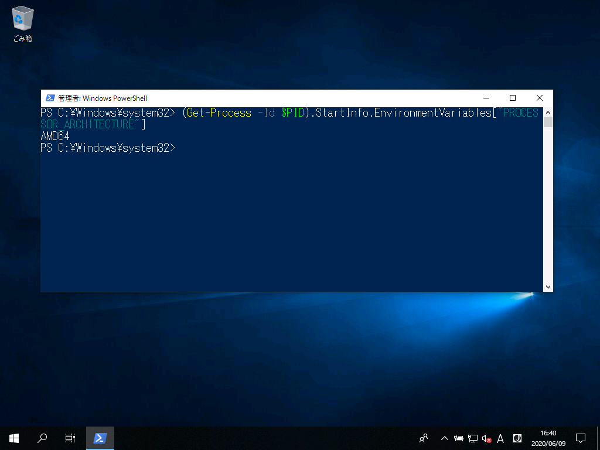
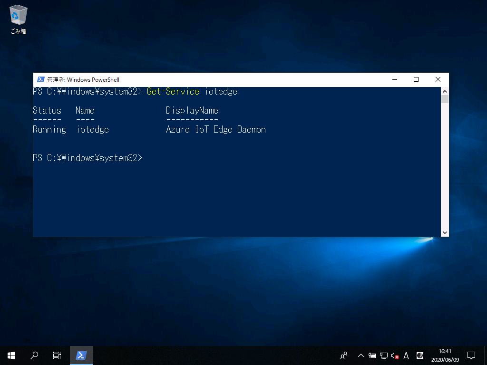
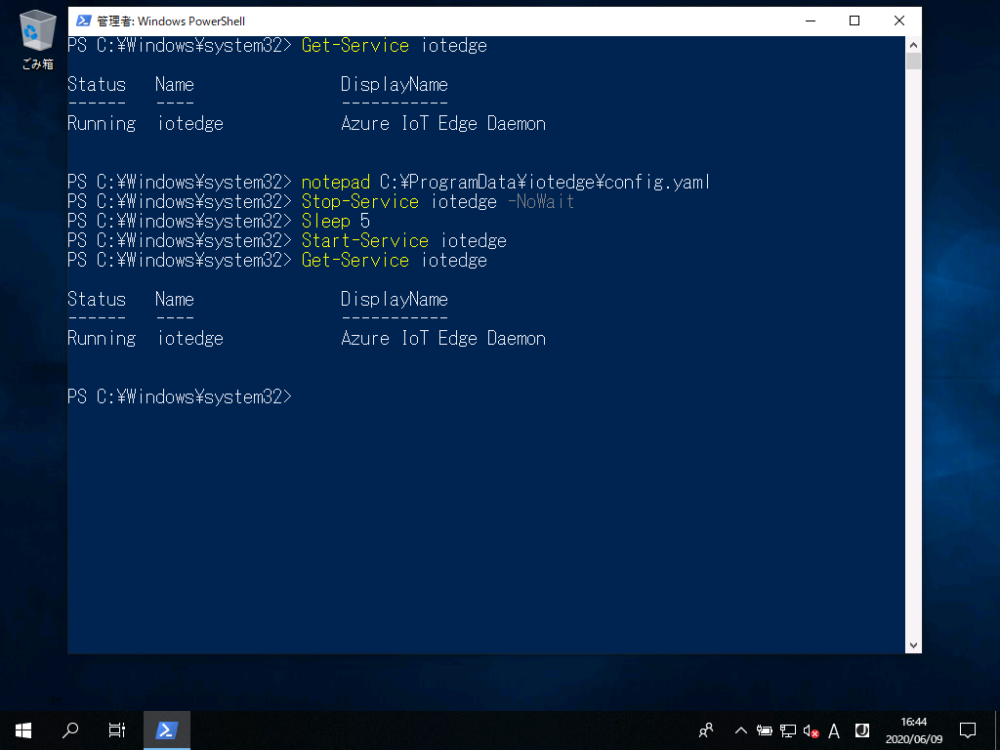
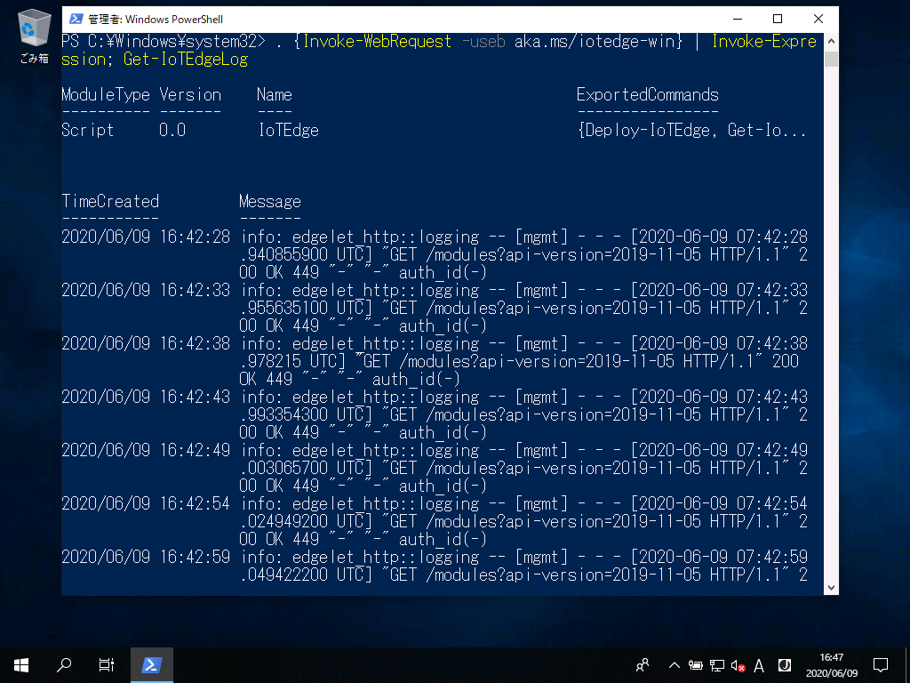
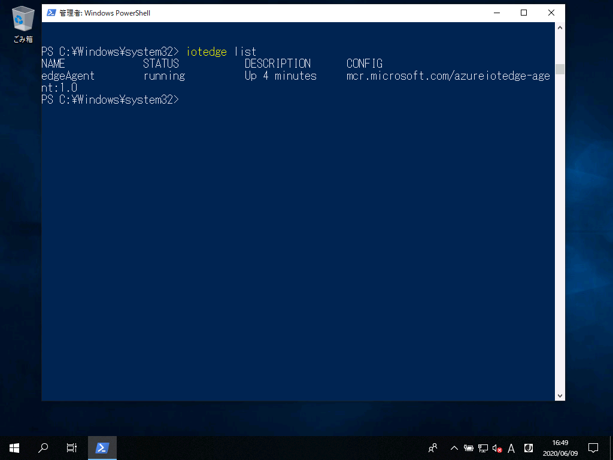
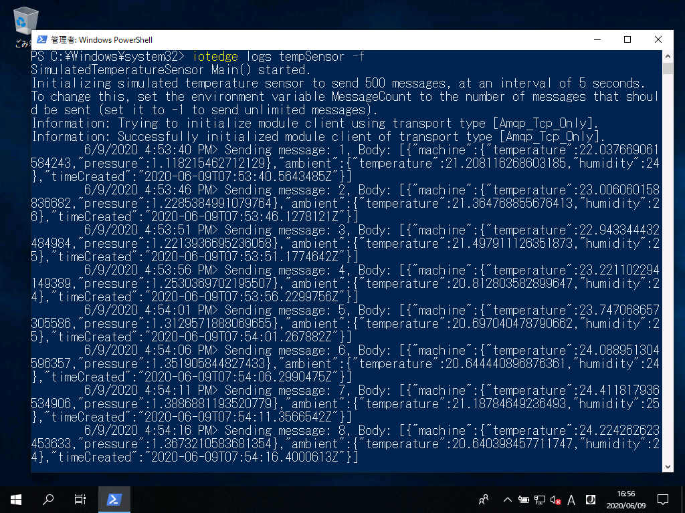

Run a simple csharp sample on OpenBlocks IoT VX2/W device running Windows 10 IoT Enterprise.
===
---

# Table of Contents

-   [Introduction](#Introduction)
-   [Step 1: Prerequisites](#Prerequisites)
-   [Step 2: Prepare your Device](#PrepareDevice)
-   [Step 3: Manual Test for Azure IoT Edge on device](#Manual)

# Introduction

**About this document**

This document describes how to connect OpenBlocks IoT VX2/W device running WIndows 10 IoT Enterprise with Azure IoT Edge Runtime pre-installed and Device Management. This multi-step process includes:

-   Configuring Azure IoT Hub
-   Registering your IoT device
-   Build and Deploy client component to test device management capability 

# Step 1: Prerequisites

You should have the following items ready before beginning the process:

-   [Prepare your development environment][setup-devbox-windows]
-   [Setup your IoT hub](https://account.windowsazure.com/signup?offer=ms-azr-0044p)
-   [Provision your device and get its credentials][lnk-manage-iot-hub]
-   [Sign up to IOT Hub](https://account.windowsazure.com/signup?offer=ms-azr-0044p)
-   [Add the Edge Device](https://docs.microsoft.com/en-us/azure/iot-edge/quickstart)
-   [Add the Edge Modules](https://docs.microsoft.com/en-us/azure/iot-edge/quickstart#deploy-a-module)
-   OpenBlocks IoT VX2/W device.

# Step 2: Prepare your Device

-   Follow the instructions in the [OpenBlocks IoT VX2/W startup guide](https://www.plathome.co.jp/wp-content/uploads/openblocks-iot-vx2w_startup_guide.pdf) to login the Windows 10 IoT Enterprise 2019 LTSC.

# Step 3: Manual Test for Azure IoT Edge on device

This section walks you through the test to be performed on the Edge devices running the Windows operating system such that it can qualify for Azure IoT Edge certification.

## 3.1 Edge RuntimeEnabled (Mandatory)

3.1.1  Create the Edge Device on Azure IoT Hub and copy the connection string.

3.1.2  Launch the PowerShell with administrator privilege.

3.1.3  Check installed Iot Edge version.

    iotedge version
    or
    iotedge --version

    

3.1.4  Check the architecture of runtime installed.
    
    (Get-Process -Id $PID).StartInfo.EnvironmentVariables["PROCESSOR_ARCHITECTURE"]

 

3.1.5  Check status of IoT Edge runtime
    
    Get-Service iotedge

 

3.1.6  To Provision the device, open the onfiguration file

-   Replace the device connection string 

        notepad C:\ProgramData\iotedge\config.yaml

        samaple
        --------------
        provisioning:
         source:"manual"
         device_connection_string:"<replace with the device connection string obtained in 3.1.1>"
-   save and close the file.

3.1.7 Restart the IoT Edge deamon

    Stop-Service iotedge -NoWait
    Sleep 5
    Start-service iotedge

3.1.8 Verify successful installation
-   Check the status of the IoT Edge Daemon

        Get-service iotedge

  

-   Examine daemon logs

        . {Invoke-WebRequest -useb aka.ms/iotedge-win} | Invoke-Expression; Get-IoTEdgeLog

 

-   List running modules

        iotedge list        

 

## 3.2 Deploy Edge module on Edge Device

3.2.1 In the Azure Portal, navigat to your IoT Hub.

3.2.2 Go to **IoT Edge** and Select you IoT edge device.

3.2.3 Select **Set Modules**.

3.2.4 In the **Deployment Modules** section of the page, click **Add** then select **IoT Edge module**.

3.2.5 In the **Name** field, enter *tempSensor*.

3.2.6 In the **Image URI** field, enter "mcr.microsoft.com/azureiotedge-simulated-temperature-sensor:1.0"

3.2.7 Leave the other settings unchanged and select **Save**.

3.2.8 Back in the **Add modules** step, select **Next**.

3.2.9 In the **Specify routes** step, you should have a default route that sends all messages from all modules to IoT Hub.

3.2.10 In the**Review Deployment** step, select **Submit**.

3.2.11 Return to the device details page in Azure and selet **Refresh**. In addition to the **edgeAgent** module that was created when you first started the service, you should see another runtime module called **edgeHub** and the **tempSensor** module listed.

3.2.12 Check the list of running modules on Device (All the modules edge agent, edge hub and TempSensor should be in running state)

    iotedge list

 

3.2.13 Check the logs for the tempSensor Edge Module.

    iotedge logs SimulatedTemperaturesensor -f

 

[setup-devbox-windows]: https://github.com/Azure/azure-iot-sdk-c/blob/master/doc/devbox_setup.md
[lnk-manage-iot-hub]: ../manage_iot_hub.md
