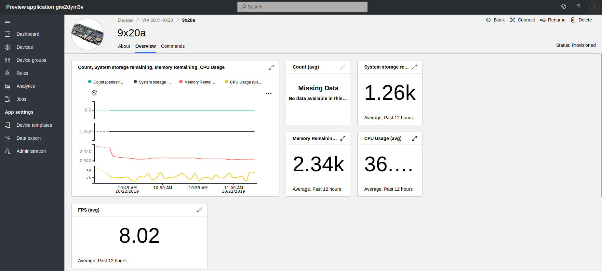

Connect VIA SOM-9X20 device to your Azure IoT Central Application
===

---
# Table of Contents

-   [Introduction](#Introduction)
-   [Prerequisites](#Prerequisites)
-   [Create Azure IoT Central application](#Create_AICA)
-   [Device Connection Details](#DeviceConnectionDetails)
-   [Prepare the Device](#preparethedevice)
-   [Integration with IoT Central](#IntegrationwithIoTCentral)
-   [Additional Links](#AdditionalLinks)

# Introduction 

**About this document**

This document describes how to connect VIA SOM-9X20 to Azure IoT Central application using the IoT plug and Play model. Plug and Play simplifies IoT by allowing solution developers to integrate devices without writing any device code. Using Plug and Play, device manufacturers will provide a model of their device to cloud developers to be integrated quickly into IoT Central or any solution built on the Azure IoT platform. IoT Plug and Play will be open to the community by way of a definition language and SDKs.

The VIA SOM-9X20 module is powered by the Qualcomm® APQ8096SG Embedded Processor and delivers the ideal balance of leading-edge performance and stunning visual and audio capabilities in a versatile and ultra-compact package for jump-starting the development of intelligent Edge AI systems and devices for an unlimited array of next-generation Smart Retail, Smart City, Enterprise IoT, Industrial IoT, and Automotive applications.

# Prerequisites

You should have the following items ready before beginning the process: 

-   [Azure Account](https://portal.azure.com)
-   [Azure IoT Hub Instance](https://docs.microsoft.com/en-us/azure/iot-hub/about-iot-hub)
-   [Azure IoT Hub Device Provisioning Service](https://docs.microsoft.com/en-us/azure/iot-dps/about-iot-dps)
-   Provide Network connectivity (Wifi, LAN) supported by the device

# Prepare the Device.

**Hardware Environmental setup**

-   Prepare VIA SOM-9X20 and connect with HDMI, 12V DC adapter, Ethernet, Micro USB and COM port.

**Software Environmental Setup **

-   Download VIA SOM-9X20 Yocto EVK v1.2.2 from [VIA SOM-9X20 Module Downloads](https://www.viatech.com/en/boards/modules/som-9x20/). Before you start to download, you need to register a acoount.
-   Download platform-tools from [here](https://developer.android.com/studio/releases/platform-tools).
-   Copy VT6093_Yocto2.0_EVK_v1.2.2_180614.tgz to your development computer and extract it. Copy `EVK\FirmwareInstall\bspinst and EVK\FirmwareInstall\bspinst\fastboot_bspinst_ufs.bat` to `platform-tools` directory.
-   Open command prompt, then change directory to platform-tools.
-   Hold on VOL\_DOWN and press power button to enter the fastboot mode. Execute fastboot\_bspinst\_ufs.bat to flash the image.
-   Open putty or any tools to connect the COM port. You can see the message from VIA SOM-9X20.
-   Download the [Azure IoT PnP Software]() from [VIA SOM-9X20 Module Downloads](https://www.viatech.com/en/boards/modules/som-9x20/).

-   Login VIA SOM-9X20 with com port. The username is "root" and password is "oelinux123". Copy the VIA-SOM-9X20-PnP-Package.tgz to VIA SOM-9X20 and extract the package by the command 

        # tar zxvf VIA-SOM-9X20-PnP-Package.tgz

# Integration with IoT Central

**Azure IoT Central Setup**

-   Create an Azure IoT Central accout and launch the public preview application.
-   Click **"Administaration" -> "Device Connection" -> "Certificates (X.509)"**. Upload and verify your certificate.
-   Generate a device certificate, private key and remenber your common name and scope id.
-   Click **"Device templates" -> "+ New"**. Choose pre-certified device **"VIA SOM-9X20"**

**VIA SOM-9X20 Setup**

-   Copy your device certificate and private key to VIA-SOM-9X20-PnP-Package/Certificate directory and rename as device-ca.pem and device-key.pem respectively. 
-   Modify the **device-name and scope-id** in **VIA-SOM-9X20-PnP-Package/pnp.conf** to yours. The device-name is your certificate common name and scope id is your **Azure IoT Central scope id.**
-   Change directory to VIA-SOM-9X20-PnP-Package and start the program by the command:

        # ./start.sh

**Check Azure IoT Central**

-   Clicks "Devices". And you can see that your VIA SOM-9X20 register to IoT Central.
-   Click your VIA SOM-9X20. You can see the messages from SOM-9X20.

 

# Additional Links

Please refer to the below link for additional information for Plug and Play 

-   [Blog](https://azure.microsoft.com/en-us/blog/iot-plug-and-play-is-now-available-in-preview/)
-   [FAQ](TBD) 
-   [Plug and Play C SDK](https://github.com/Azure/azure-iot-sdk-c/tree/public-preview) 
-   [Plug and Play Node SDK](https://github.com/Azure/azure-iot-sdk-node/tree/digitaltwins-preview)
-   [Plug and Play Definitions](https://github.com/Azure/IoTPlugandPlay)

